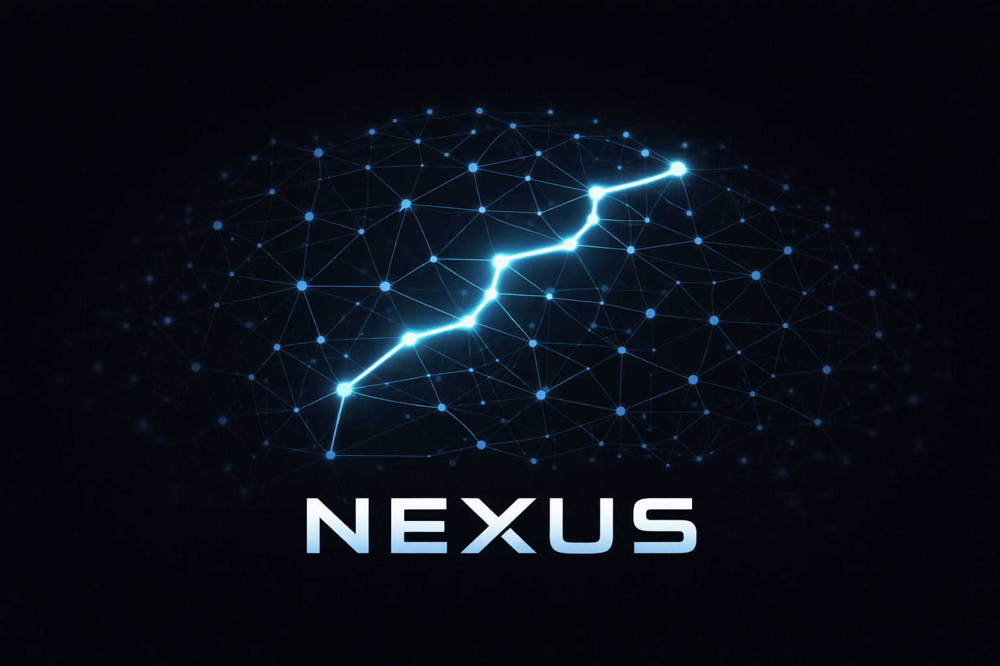
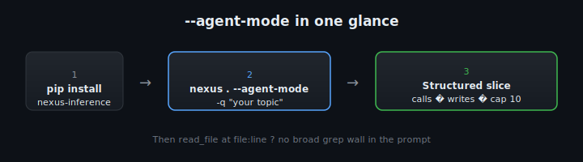

# Nexus



> **Grep with structural understanding.**  
> **Stop reading code. Start querying structure.**

Nexus is a **static, heuristic inference layer** for Python. It scans `.py` trees (AST + heuristics) and keeps an in-memory **map**: symbols, call edges, reads/writes, mutation hints, layers, and confidence. You **query** that map with bounded outputs (briefs, compact slices, optional JSON) instead of treating the repo like a flat full-text haystack.

| | |
|--|--|
| **Status** | **`0.1.0`** (first packaged milestone on the `0.x` line) — inference-facing CLI and output shapes may still evolve within **minor** `0.x` releases; high-impact shifts are noted in **[`docs/patchnotes/`](docs/patchnotes/README.md)** and GitHub Releases (**Contract impact**). |
| **Python** | **3.10+**; CI runs **3.10** and **3.12** on **Ubuntu** and **Windows** (see `.github/workflows/ci.yml`). |
| **Good for** | Orientation, “where does this live?”, mutation/impact-style questions in **Python** repos — especially **agent** workflows with token budgets. |
| **Not** | A linter, type checker, profiler, or guarantee of runtime behavior — the graph is a **navigation aid** (see **[Repo health & known limitations](#repo-health-known-limitations)**). |

**Documentation:** **[`docs/README.md`](docs/README.md)** (index of all `docs/`) · **Agents:** [`AGENTS.md`](AGENTS.md) · **Security / exports:** [`SECURITY.md`](SECURITY.md) · **Changelog:** [`CHANGELOG.md`](CHANGELOG.md) · **Releases:** [GitHub](https://github.com/MechanicalDeus/Mechanicals-Nexus---Inference-Control/releases)

**Workflow (typical):** Each CLI run builds (or reuses, if you opt into cache modes) a graph for the chosen root; you issue **`-q`** queries with caps and get **symbols, calls, writes**, and **`NEXT_OPEN`** hints — refine with a **tighter query** or **read source** where it matters. That moves **search-shaped** work off the prompt and onto the **local** scan; it is **not** mainly “text compression,” it is **less whole-file context before you know shape**.

---

## Agent quick start (install → one command)

**Opinionated defaults** for LLM/agent workflows: structural compact output, **calls + writes** fields, **10** symbols — override anytime with `--max-symbols`, `--compact-fields`, or another `--perspective`.

**What you get:** a **compact, structured map** of the most relevant symbols for your query — mainly **calls** and **writes** — so you can orient fast without a wall of prose.



```bash
python -m pip install "nexus-inference @ git+https://github.com/MechanicalDeus/Mechanicals-Nexus---Inference-Control.git"
cd your-python-repo
nexus . --agent-mode -q "what handles mutations?"
```
*(Other install paths: [Installation](#installation).)*

More one-liners (same mode, different intent):

```bash
# core mutation / state-touching logic
nexus . --agent-mode -q "mutation"

# where state is read or updated
nexus . --agent-mode -q "state"

# orchestration, HTTP, or “how requests move”
nexus . --agent-mode -q "request flow"
```

**When to use what:** **`--agent-mode`** → fast structural orientation (agents, tight context). Plain **`nexus -q …`** (default **llm_brief**) → richer narrative brief, special modes like **`impact`** / **`why`**. Use the default when you need explanation depth; use **`--agent-mode`** when you need a **small, parse-friendly** slice first.

Developing from a checkout: `pip install -e .` (or `PYTHONPATH=…/src` and `python -m nexus …`). Details, metrics, and patch notes: **[`docs/token-efficiency.md`](docs/token-efficiency.md)** · **[`docs/patchnotes/README.md`](docs/patchnotes/README.md)**.

*Optional:* record the terminal once — motion helps — but the chart below is the quantitative view.

### Measured stdout tokens (example: large Python app)

**Controlled local run** on one checkout (**TTRPG Studio** `app/`, ~59 files / 1530 symbols in the graph). **Four queries** (`mutation`, `resolver engine`, `session export`, `transcription`), **tiktoken** `cl100k_base`, summed **`output_tokens_tiktoken`** from **`--metrics-json`** (stderr). Same inference pass per invocation; only **output projection** differs.


| Mode | Σ output tokens (4 queries) | % of `llm_brief` |
|------|----------------------------:|-----------------:|
| `nexus -q …` default (**`llm_brief`**, `--max-symbols` **12**) | **24 655** | 100% |
| `--perspective agent_compact` **`full`** (cap **12**) | **9 057** | 37% |
| **`--agent-mode`** (product default: **minimal** fields, cap **10**) | **4 182** | 17% |

With **`--agent-mode`** but **`--max-symbols` 12** explicitly matched to the brief row: **~4 479** (~18%). **N=1** checkout; your tree and queries will differ — use **`extras/nexus_benchmark.py`** + **`--metrics-json`** to reproduce on your project.

---

## Why structure first?

Exploratory workflows often burn context when the **model acts like a file browser** (open → read everything → guess). Line tools (`grep`, `rg`) return **text hits**, not **who calls whom** or **where state might change**.

Nexus is meant for **query → bounded structural answer → targeted read** (see the **Workflow** paragraph in the opening summary above). For **limits** (AST, heuristics, no runtime truth), use **[Repo health & known limitations](#repo-health-known-limitations)**.

## Quick example (PoC)

```bash
nexus-grep . -q "mutation" --max-symbols 10
```

Safe-by-default wrapper (scope gating + staged caps):

```bash
nexus-policy . -q "state"
```

Deeper, still bounded:

```bash
nexus . -q "mutation" --max-symbols 5
```

**Defaults (query mode, `-q`):** If you omit `--max-symbols`, Nexus caps the heuristic slice at **12** symbols. The brief then adds **`NEXT_OPEN`** (up to three suggested `file:line` slices) and collapses **same simple name** duplicates into one primary block plus a compact **`SAME_NAME`** summary / `same_name_also` line — fewer tokens, less repetition. **Full maps** (`--json`) can be **huge** next to the tool or a single prompt; **slicing** is how you keep context human- and model-sized (see **[`docs/token-efficiency.md`](docs/token-efficiency.md)**).

**Minimal tokens, still interpretable:**

```bash
nexus . -q "mutation" --names-only --max-symbols 10
```

**Names + confidence/tags/layer/path in one line per symbol** (slightly larger than plain names-only, fewer follow-up questions):

```bash
nexus . -q "mutation" --names-only --annotate --max-symbols 10
```

**Canonical perspectives** (same vocabulary as the library and Inference Console): `nexus --perspective <name>` with optional `--center-kind`, `--center-ref`, `--mutation-key`. See **[`docs/cli-perspective.md`](docs/cli-perspective.md)** for the requirement table and `--debug-perspective` (stderr provenance).

Example mutation-chain fragment when analysing this repo (your project will differ):

`src.nexus.cli.main → src.nexus.scanner.attach → src.nexus.scanner.scan → src.nexus.scanner._scan_impl → src.nexus.scanner._tag_symbol`

**Tutorial hub:** **[`TUTORIAL.md`](TUTORIAL.md)** (links to the full guide, screenshots, and related docs).

**Patchnotes (release-style reports):** **[`docs/patchnotes/README.md`](docs/patchnotes/README.md)** — Messmetriken, neue CLI/Perspektiven, Benchmark-Hinweise; aktuell z. B. [Agent-Ausgabe & Metriken (2026-04-03)](docs/patchnotes/2026-04-03-agent-output-und-metriken.md).

**Repository analysis** (architecture, risks, packaging, roadmap — full map): **EN** [`docs/repository-analysis.md`](docs/repository-analysis.md) · **DE** [`docs/repository-analyse.md`](docs/repository-analyse.md).

More narrative walkthrough: [`docs/proof-of-concept.md`](docs/proof-of-concept.md).

## Efficiency: one scan, bounded prompts

The expensive part for LLM workflows is **not** the local AST pass — it is **repeated full-file context** in the prompt. Nexus **amortizes** on the **CPU**: one scan builds the graph; each **follow-up** is a **cheap structural query** (new `-q`, tighter caps) instead of pasting more files. The **model’s loop** becomes *ask Nexus → interpret slice → ask again*, not *open next file → read everything*.

**Amortization nuance:** Comparing only **total** tokens with vs without Nexus **does not show what those tokens paid for**. With Nexus, one thing is **structural** for the orientation phase: the model is **not** spending that context on **search-shaped** work (huge grep walls, exploratory full-file churn) — that part runs **locally**. Totals still include reasoning, edits, and targeted reads; see **[`docs/token-efficiency.md`](docs/token-efficiency.md)** §1.1.

**Reproducible numbers** (this repo + reference legacy scans), log-style before/after, and full **amortization** discussion: **[`docs/token-efficiency.md`](docs/token-efficiency.md)**.

**Why savings grow with repo size** (informal architecture note, not a formal proof): **[`docs/nexus-scaling-law.md`](docs/nexus-scaling-law.md)**.

**Empirical agent metrics** (Cursor usage dashboards, screenshots, and how to read them): see **[§ Metrics](#metrics)** below and the full write-up **[`docs/usage-metrics.md`](docs/usage-metrics.md)**.

**Case study (two repos, zero file opens):** **[`docs/case-study-cross-repo-orientation.md`](docs/case-study-cross-repo-orientation.md)** — cross-checkout comparison via **`nexus.cli_opc`** only; **~110k** session tokens vs **naive full-`.py` ingest** at **TTRPG-scale**. **Measuring stick** (disk + `.py`, **2026-04-03**, single canonical table): **[§ Measuring stick (measured sizes, 2026-04-03)](docs/case-study-cross-repo-orientation.md#measuring-stick-measured-sizes-2026-04-03)** in that doc — **do not** fork ad-hoc size figures elsewhere.

## Metrics

**Measuring stick (checkout scale):** **Disk** and **`.py`** numbers cited below for **Nexus** / **TTRPG Studio** / cross-repo narrative are **tied** to **[`docs/case-study-cross-repo-orientation.md` § Measuring stick (measured sizes, 2026-04-03)](docs/case-study-cross-repo-orientation.md#measuring-stick-measured-sizes-2026-04-03)** — one canonical table; do not duplicate with ad-hoc estimates.

Real **Cursor** usage rows (Included / **auto**): **Total**, **Cache Read**, **Input**, **Output** — **not** local AST time. Use this section as a **quick index**; narrative + honesty constraints live in **[`docs/usage-metrics.md`](docs/usage-metrics.md)**.

| Layer | What it shows | Headline |
|-------|----------------|----------|
| **Small checkout** (**Nexus** repo, **~13 MB** on disk — measured 2026-04-03) | Build-leaning sessions **with** vs **without** Nexus | Totals differ; **fresh Input** almost flat — **tiny graph**, not a stress test for orientation. |
| **Large checkout** (**TTRPG Studio**, **~7.1 GB** on disk — measured; **N=1**) | **Same analysis-only prompt**, Nexus on vs off | **Fair** anchor for **analysis**: **~43%** lower **Total**, **~25%** lower **Input**; big **Cache Read** delta — **[details](docs/usage-metrics.md#controlled-benchmark-ttrpg-studio-same-task-with-vs-without-nexus)**. |
| **Gallery** | **Build without Nexus** (high totals) vs **analysis with Nexus** (lower totals) | Dashboard ratios **~7×–15×** are **real** but **confound task type** with retrieval — **not** a controlled “Nexus multiplier” for analysis. See **[`docs/usage-metrics.md`](docs/usage-metrics.md)**. |
| **Cross-repo case study** | **Two** local Python trees compared **without opening** their source/docs in the agent — **Nexus-only** orientation | **[`docs/case-study-cross-repo-orientation.md`](docs/case-study-cross-repo-orientation.md)** + figure **[`cursor-cross-repo-orientation-110k.svg`](docs/assets/usage-metrics/cursor-cross-repo-orientation-110k.svg)** (placeholder until a PNG is committed) — **N=1**, **representation shift** vs naive ingest; **measuring stick** for disk / `.py`: **[same doc § Measuring stick](docs/case-study-cross-repo-orientation.md#measuring-stick-measured-sizes-2026-04-03)**. |

### Controlled benchmark — large Python checkout (TTRPG Studio)

**Same analysis-only task** wording, **with Nexus** vs **without** (one captured pair). **~314k** vs **~180k** total tokens; **Cache Read** carries most of the gap. This is the **primary** quantitative anchor in this repo for “Nexus on analysis.”

| With Nexus | Without Nexus |
|------------|----------------|
|  |  |

### Small checkout — Nexus analyzed with Nexus (this repository)

**~169k** row (example): **Cache Read** still dominates; totals stay **far below** million-token “exploration” sessions. **Fresh Input** ~**8.7k** — comparable to a **without-Nexus** build row on the same small tree (**~7.7k**), i.e. **marginal** orientation win here.


### Gallery — build vs analysis (illustrative, not apples-to-apples)

**Without** Nexus: **build / implementation** sessions (high totals). **With** Nexus: **analysis-orientation** sessions (lower totals). Comparing them yields large ratios that **mix task type and tool policy** — see **[`docs/usage-metrics.md`](docs/usage-metrics.md#gallery-numbers-build-without-nexus-vs-analysis-with-nexus)**. Full images: **[`docs/assets/usage-metrics/`](docs/assets/usage-metrics/)** · **[gallery](docs/usage-metrics.md#screenshot-gallery)**.

| Without Nexus (example) | With Nexus (example) |
|-------------------------|----------------------|
|  |  |

## Mental model

| Without Nexus        | With Nexus              |
|---------------------|-------------------------|
| Model opens files → reads text → guesses structure | **CPU** scans once → **model queries map** → gets **structural slice** → opens source **only when needed** |
| Search → read → guess | **Query structure** → narrow region → read targeted code |

## Installation

Requires **Python 3.10+**. CI runs **3.10** and **3.12** on **Ubuntu** and **Windows** (see `.github/workflows/ci.yml`).

After install, these entry points are available: **`nexus-opc`**, **`nexus`**, **`nexus-grep`**, **`nexus-policy`**, **`nexus-cursor-rules`**, **`nexus-console`**. The **pip distribution** name is **`nexus-inference`** — that is **not** a shell command.

**GUI quick start (same as `nexus-console`):** `nexus ui` or `nexus console` — works in **cmd.exe** / PowerShell once **`nexus-inference[ui]`** is installed.

### From PyPI

When the package is on the index:

```bash
pip install nexus-inference
```

**Index:** [pypi.org/project/nexus-inference](https://pypi.org/project/nexus-inference/) — if it is not there yet, use **GitHub** or a **clone** below.

### From GitHub (no local clone)

Install from the default branch (`main`) with **pip** or **pipx**:

```bash
python -m pip install "nexus-inference @ git+https://github.com/MechanicalDeus/Mechanicals-Nexus---Inference-Control.git"
```

```bash
pipx install "nexus-inference @ git+https://github.com/MechanicalDeus/Mechanicals-Nexus---Inference-Control.git"
```

Pin a **tag** or **branch** with a suffix on the URL, e.g. `…Inference-Control.git@v0.1.0` or `…@main` (see [pip — VCS support](https://pip.pypa.io/en/stable/topics/vcs-support/)).

### From a clone (contributors)

```bash
git clone https://github.com/MechanicalDeus/Mechanicals-Nexus---Inference-Control.git
cd Mechanicals-Nexus---Inference-Control
pip install -e .
# or: pipx install -e .
```

### Nexus Inference Console (optional GUI)

Same inference engine as the CLI: attach a repo, run a query, inspect a **bounded slice**, **trust metadata**, **mutation trace**, and a **one-hop focus graph**; copy **minimal names**, **balanced brief**, or **slice JSON** for LLMs. The console does **not** run a second analyzer — **Copy Brief** is the same `to_llm_brief` text you would get from `nexus -q` with the same query and caps ([tutorial](docs/inference-console-tutorial.md#same-facts-for-humans-and-for-the-llm)).

```bash
python -m pip install "nexus-inference[ui] @ git+https://github.com/MechanicalDeus/Mechanicals-Nexus---Inference-Control.git"
```

From a clone:

```bash
pip install -e ".[ui]"
nexus ui
# same: nexus-console
```

- **[`TUTORIAL.md`](TUTORIAL.md)** (start here) → **[full walkthrough](docs/tutorial-nexus-cli-and-ui.md)**  
- **[Opcode ISA (`nexus-opc`)](docs/tutorial-nexus-opc-isa.md)** — deterministic CLI for agents  
- **[Console quick steps](docs/inference-console-tutorial.md)** · **[Deep dive](docs/inference-console-deep-dive.md)**

### Cursor rules (bundled in the package)

The `.mdc` rule ships inside **`nexus-inference`** (`nexus.cursor_rules`). Cursor loads project rules from **`.cursor/rules/`**.

```bash
cd /path/to/your/python/project
nexus-cursor-rules install
# same: python -m nexus.cursor_rules install
# overwrite: nexus-cursor-rules install --force
# show bundled path: nexus-cursor-rules --path
```

Bundled source in this repo: [`src/nexus/cursor_rules/nexus-over-grep.mdc`](src/nexus/cursor_rules/nexus-over-grep.mdc). Extra notes: [`extras/cursor-rules/README.txt`](extras/cursor-rules/README.txt).

**Agent + Cursor (explanation anchor):** **[`docs/nexus-agent-cursor.md`](docs/nexus-agent-cursor.md)** — how the agent loop uses Nexus, what appears in the terminal, rules, and limits.

## Repo health & known limitations

- **Python:** Requires **3.10+**; tested in CI on **3.10** and **3.12** (Windows + Linux). Other 3.x versions may work but are not part of the matrix.
- **Static analysis:** Nexus is **AST-based** and **approximate**. Dynamic patterns (`setattr`/`getattr` indirection, runtime imports, decorators, frameworks that register handlers implicitly) may be **missing**, **merged**, or **over-linked**. Treat the graph as a **navigation aid**, not a formal proof of behavior.
- **Confidence & layers:** Scores and tags (e.g. mutation hints, layers) are **heuristics** to rank and filter slices. They can be **wrong** or **noisy** on edge-heavy code — **verify** on source for correctness-critical or security-sensitive paths.
- **Query strings (`-q`):** Heuristic keyword / identifier matching, not a full NL interface inside Nexus; the **agent or human** chooses the next query. Prefer **concrete symbols** and **file-local names** over vague buzzwords (see **`AGENTS.md`** and **`docs/token-efficiency.md`**).
- **Scale:** Very large trees cost **I/O + parse time**; use **subpaths**, **`nexus-grep`**, **`nexus-policy`**, and **caps** before reaching for full **`--json`** exports.

## Library

```python
from nexus import attach

g = attach("./your_repo")
print(g.to_json())
```

Use **`--json` / saved exports only when necessary** — they can be **security-sensitive** (see below).

## Usage flow (agents & humans)

1. **`nexus-opc locate`** (or **`nexus-grep`**) — small, relevant symbol/file slice without inventing flags.  
2. **Open only those files** in the editor or prompt.  
3. **`nexus -q`** — impact, mutation chains, etc., with a tight **`--max-symbols`** (when opcodes are not enough).  
4. **`nexus . --json`** — full graph export **only** if you need it and can keep it **private**.

Agent-oriented checklist: [`AGENTS.md`](AGENTS.md). Executive summary: [`NEXUS-REPORT.md`](NEXUS-REPORT.md).

## Safety features (what keeps output bounded)

Nexus is designed to be **token-efficient**, but also to reduce “oops” moments in agent workflows:

- **Bounded slices**: query mode defaults to a small heuristic cap (12 symbols if `--max-symbols` is omitted).
- **Names-only modes**: `--names-only` (and `--annotate`) produce one line per symbol instead of verbose briefs.
- **Same-name folding**: duplicates are collapsed into a primary block plus a compact `SAME_NAME` summary.
- **Safe wrapper (`nexus-policy`)**: applies **scope gating** + **risk-based caps** + **staged retrieval** and enforces a hard output bound (chars + lines). Stage 3 is **explicit only** (never automatic).
- **Control headers**: optional bounded `[NEXUS_CONFIG]` header (`--control-header` / `NEXUS_CONTROL_HEADER=1`) on stderr for observability without dumping map content.
- **Governance files**: `.nexusdeny` / `.nexusignore` / `.nexus-skip` prevent sensitive subtrees from being discovered or inferred (details in `SECURITY.md`).

## Security: inference maps

Generated maps (JSON graphs, large briefings) can expose **architecture, paths, and sensitive flows**. **Do not commit them.** Read [`SECURITY.md`](SECURITY.md) (including **`.nexusdeny` / `.nexusignore`**) and use the `.gitignore` patterns in this repo as a template for your projects.

**Take:** better targeting for LLMs also raises the stakes for *what* gets opened — see the short **“Take: agents and governance (small oops)”** section in [`SECURITY.md`](SECURITY.md#take-agents-and-governance-small-oops) and the screenshot there.

## Positioning

Nexus is **not** a linter, type checker, or profiler. It is a **static, heuristic inference layer** optimised for **context-efficient** navigation — a form of **semantic code indexing for LLM workflows** (and for humans who want the same map). The pitch is not “another AST tool”; it is **the LLM querying structure on your machine** instead of **opening files to discover** it — **meaning-shaped slices** before bulk text.

## Tutorial

Guided walkthrough: **CLI** (including in your IDE terminal), optional **Inference Console**, screenshots, and why **CLI / GUI / pasted brief** share the **same** inference map.

| | |
|--|--|
| **Entry point** | **[`TUTORIAL.md`](TUTORIAL.md)** |
| **Documentation index** | **[`docs/README.md`](docs/README.md)** (all `docs/` in one table) |
| **Full guide** | **[`docs/tutorial-nexus-cli-and-ui.md`](docs/tutorial-nexus-cli-and-ui.md)** |
| **Opcode ISA** (`nexus-opc`, agents) | [`docs/tutorial-nexus-opc-isa.md`](docs/tutorial-nexus-opc-isa.md) |
| **CLI in the IDE** (local, bounded output) | [Section in full guide](docs/tutorial-nexus-cli-and-ui.md#cli-in-the-ide-local-fast-bounded-output) |
| **Console** quick steps | [`docs/inference-console-tutorial.md`](docs/inference-console-tutorial.md) |
| **Architecture** (session, exports) | [`docs/inference-console-deep-dive.md`](docs/inference-console-deep-dive.md) |
| **Console screenshots (current UI)** | [`docs/ui-screenshots/`](docs/ui-screenshots/) |
| **CLI IDE proof + metrics PNGs** | [`console tutorial/`](console tutorial/) (see [`docs/tutorial-nexus-cli-extended.md`](docs/tutorial-nexus-cli-extended.md#0-other-assets-in-console-tutorial)) |
| **Usage metrics** (agent token dashboards) | **[§ Metrics](#metrics)** · [`docs/usage-metrics.md`](docs/usage-metrics.md) · [`docs/assets/usage-metrics/`](docs/assets/usage-metrics/) |
| **Scaling argument** (amortized graph vs text search) | [`docs/nexus-scaling-law.md`](docs/nexus-scaling-law.md) |

---

## Development

```bash
pip install -e ".[dev]"
pytest
```

## License

**This repository (library + CLIs except the optional GUI)** is licensed under the **MIT License** — see [`LICENSE`](LICENSE).

**Optional Inference Console** (`pip install …[ui]`, `nexus-console`) adds **PyQt6**, which is **dual-licensed (GPLv3 or commercial)** from Riverbank Computing — not LGPL. If you **redistribute** or **bundle** the GUI, you must **satisfy PyQt/Qt compliance** (or use a commercial PyQt license). The MIT license here applies to **Nexus source code**; it does not replace PyQt’s terms. Third-party notes: [`docs/licensing.md`](docs/licensing.md).
