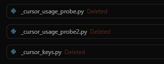

# Security Notice — Nexus Inference Maps

## Sensitive data warning

Nexus generates **inference maps** (e.g. JSON graph exports, saved briefings) that can contain:

- Structural relationships between code symbols  
- Call graphs and mutation chains  
- Heuristic behavioral / state-touching analysis  
- File paths and qualified names across your tree  

These artifacts may reveal:

- Internal architecture and module layout  
- Sensitive control flows and integration points  
- Security-relevant mutation or trust boundaries  

Treat them as **highly sensitive**: comparable to sharing **source plus an architectural index** of the scanned codebase.

## Take: agents and governance (small oops)

**Relevance is not safety.** Tools that help agents find “the right” files faster also make it easier to surface **cached configs, local state databases, or keys** if nothing stops the model from printing them. Deleting probe scripts *after* the fact does not undo what already appeared in chat or terminal history — **guardrails belong before exposure**, not only as regret.

That tension is part of why Nexus distinguishes **`.nexusdeny`** (hard, out-of-tree) from **`.nexusignore`** (in-tree, no plaintext mapping): structure and governance for *what may be inferred*, not only *what is easy to find*.

## Do not commit generated maps

Generated inference data must **not** be committed to version control or pasted into public issues/PRs unless you have explicitly cleared that with your security policy.

## Excluding paths from scans (`.nexusdeny` / `.nexusignore` / `.nexus-skip`)

### `.nexusdeny` — outside the mapped tree (hard deny)

Nexus does **not** read `.nexusdeny` from **inside** the scan root.

- **`.nexusdeny`** — searched on **every ancestor** of the scan root (parent, grandparent, … up to the volume root). Each file found is merged: matching paths are **not discovered at all** (no filenames from denied subtrees in the graph). Syntax: comments with `#`, `/` prefix = root-relative to the mapped tree, trailing `/` = directory; patterns without `/` match the **basename** in any subdirectory.
- Optional: environment variable **`NEXUS_DENY_PATH`** points at another file; its rules are merged with all ancestor `.nexusdeny` files.

Use this when the tree should **not appear** in Nexus output (e.g. huge vendored trees, strict air-gap).

### `.nexusignore` — inside the scan root (plaintext not mapped)

- **`.nexusignore`** — lives **at the scan root** (same folder you pass to `nexus` / `attach`). Same pattern syntax as `.nexusdeny`. Matching `.py` files get a **stub** `FileRecord` with `redacted: true`: **no source read**, **no AST**, **no symbols** — so inference never sees plaintext. Paths still appear in exports/briefs as boundaries (listed under a “plaintext not mapped” line in LLM briefs).

Use this for modules that must stay out of **semantic** inference while you still want a visible “something is here” marker.

### `.nexus-skip`

- **`.nexus-skip`** — if this file exists **inside** a directory under the scan root, that directory and **everything below it** is skipped (local subtree marker only).

## Recommended practice

- Generate maps **locally** only.  
- Keep exports **out of the repo** (see root `.gitignore` patterns).  
- Share **redacted summaries** or hand-picked snippets if you need help — not raw full graphs.  
- For CI: avoid archiving full `--json` exports as public artifacts unless the scanned tree is non-sensitive.

## Reporting security issues in Nexus itself

If you believe you have found a security vulnerability in **this tool** (the Nexus package), please open a **private** advisory via GitHub Security Advisories for the repository, or contact the maintainers through a non-public channel they document in the repo.

---

**In one line:** Inference maps are a **semantic index of the code you scanned** — handle them like confidential engineering material.
