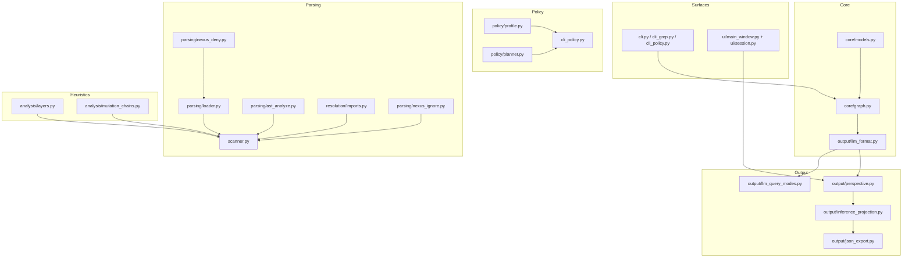

# Analyse des GitHub-Repositorys Mechanicals-Nexus---Inference-Control

## Executive Summary

Das Repository implementiert ein Python-Paket namens **`nexus-inference`**, das eine „Inference Map“ (strukturierte Repräsentation) aus Python-Quellcode erzeugt: Symbole (Funktionen/Klassen/Methoden), Call-Edges, heuristische Read/Write- und Mutationshinweise, „Layer“-Klassifikation sowie einen Confidence-Score. Ziel ist, Orientierung und Impact-/Mutationsfragen in großen Codebasen **nicht** über breit streuende Textsuche („grep/rg“) und „File-Browsing im Prompt“ zu lösen, sondern über **lokal** erzeugte Struktur, die anschließend **budgetiert** (capped) in LLM- oder Human-Workflows eingespeist wird. Das zentrale Nutzenversprechen ist damit eher *„Suche/Navigation aus dem Prompt auf die CPU verlagern“* als reine Textkompression. fileciteturn78file0L1-L1 fileciteturn20file0L1-L1 fileciteturn16file0L1-L1

Kernfunktionen und Oberflächen sind klar getrennt: (1) Scan/Graph-Aufbau (`attach`/`scan`), (2) Query-/Slicing-Logik und perspektivische Projektionen („Perspectives“), (3) Ausgabeoberflächen: CLI (`nexus`, `nexus-grep`, `nexus-policy`, …) und optional ein PyQt-basiertes GUI („Inference Console“). Das Repository enthält zudem konkrete Governance-/Safety-Mechaniken (z. B. `.nexusdeny`, `.nexusignore`, Output-Caps, Control-Header) und eine explizite Security-Positionierung, die Inference-Exporte als potentiell sensibel klassifiziert. fileciteturn25file0L1-L1 fileciteturn43file0L1-L1 fileciteturn18file0L1-L1 fileciteturn23file0L1-L1

Reifegrad/Engineering-Signal: Es gibt CI (Windows+Ubuntu, Python 3.10/3.12) mit Lint/Format über Ruff und Tests via Pytest. Eine Coverage-Untergrenze ist konfiguriert (Fail-under 52 %), was für ein frühes Beta-Paket realistisch ist, aber auch anzeigt, dass Testabdeckung als „mindestens baseline“ und nicht als starkes Qualitätsgonzo priorisiert wird. fileciteturn22file0L1-L1 fileciteturn16file0L1-L1

Wesentliche Risiken: (a) Die Analyse ist heuristisch (AST-basiert), damit bei dynamischen Python-Idiomen begrenzt; das wird im Repo selbst offen benannt. (b) Exporte/Cache können Architektur- und Pfadinformationen preisgeben; der Code behandelt das explizit als Security-Thema (opt-in Caching; `.gitignore`-Patterns; `.nexusdeny` außerhalb des Scan-Roots). (c) Lizenz-/Distributionsthema: Das Kernpaket ist MIT-lizenziert, aber das optionale GUI hängt von PyQt6 ab, das dual lizenziert (GPLv3 oder kommerziell) ist—für Distributionsszenarien kann das Compliance-relevant sein. fileciteturn78file0L1-L1 fileciteturn18file0L1-L1 fileciteturn33file0L1-L1 citeturn7search1turn7search2

Annahmen/Limitierungen dieser Analyse: Eine „vollständig enumerierte“ Dateiliste (inkl. aller Binärassets) ist in dieser Sitzung nur indirekt über referenzierte Dateien in Doku/Build-Konfiguration rekonstruierbar. Der reportete File-Tree ist daher **maximal granular für die verifizierten Text-/Code-Dateien** und **repräsentativ** für Asset-Ordner (PNG etc.), aber nicht garantiert eine bytegenaue vollständige Aufzählung jeder einzelnen Bilddatei. fileciteturn16file0L1-L1 fileciteturn59file0L1-L1

## Zweck und Lösungsansatz

Das Repository positioniert Nexus als „Inference Layer“ zwischen Quellcode und Reasoning-Systemen: Aus einem Baum von `.py`-Dateien wird eine strukturierte Karte erzeugt, die statt flacher Trefferlinien (grep) **Symbolkarten**, **Call-Beziehungen**, **Mutations-/State-Touching-Hinweise**, **Confidence** und **Layer** liefert. Der Duktus ist stark Agent-/LLM-orientiert („Stop reading code. Start querying structure.“). fileciteturn78file0L1-L1 fileciteturn20file0L1-L1 fileciteturn21file0L1-L1

Das Tooling folgt einem bewussten „Tiering“-Prinzip:

- **Thin first**: `nexus-grep` oder `--names-only`/`--annotate` sollen zuerst eine kleine Kandidatenmenge liefern (Token-schonend). fileciteturn29file0L1-L1 fileciteturn42file0L1-L1  
- **Read slices**: Anschließend werden ausgewählte Dateislices gelesen (über `NEXT_OPEN`-Hinweise und `file:line`-Metadaten). fileciteturn42file0L1-L1 fileciteturn78file0L1-L1  
- **Deeper only if needed**: Spezialabfragen (`impact`, `why`, „mutation chain“, „core flow“) über `nexus -q …` / `llm_brief`. fileciteturn46file0L1-L1 fileciteturn42file0L1-L1  
- **Full export selten**: `--json` (Vollgraph) ist als sensibler Sonderfall adressiert. fileciteturn18file0L1-L1 fileciteturn23file0L1-L1

Wichtiger Punkt in der Repo-Argumentation: Nexus wird nicht primär als „Token-Kompressor“ verkauft, sondern als **Umverteilung der Kosten**: Ein einmaliger lokaler Scan (CPU) vs. wiederholte Prompt-Kontextkosten. Diese „Amortization“-These wird in `docs/token-efficiency.md` und den Usage-Metriken (Cursor-Screenshots) breit diskutiert—inkl. der Warnung, dass reine Totals („mit vs ohne“) methodisch leicht unfair sind, wenn Task-Typen vermischt werden. fileciteturn58file0L1-L1 fileciteturn59file0L1-L1 fileciteturn69file0L1-L1

## Architektur und Datenfluss

### High-Level-Pipeline

Die Architektur ist im Kern ein deterministischer Pipeline-Stack:

1. **Discovery & Parsing**: `.py`-Dateien werden entdeckt (mit Skip-/Deny-Regeln), gelesen und AST-geparst. fileciteturn34file0L1-L1 fileciteturn25file0L1-L1 fileciteturn38file0L1-L1  
2. **Graph Construction**: Aus Symbolen/Calls/Reads/Writes wird ein `InferenceGraph` aufgebaut (Nodes=`SymbolRecord`, Edges=`Edge`). fileciteturn27file0L1-L1 fileciteturn26file0L1-L1 fileciteturn25file0L1-L1  
3. **Heuristische Inferenz**: Indirekte/Transitive Writes, Tags, Confidence, Layer, Mutation Paths (Ranking). fileciteturn25file0L1-L1 fileciteturn41file0L1-L1 fileciteturn40file0L1-L1  
4. **Projection/Views**: Query-Slices, „Perspectives“, LLM-Briefs, JSON-Slices, Focus Graph, Mutation Trace. fileciteturn43file0L1-L1 fileciteturn42file0L1-L1 fileciteturn44file0L1-L1  
5. **Surfaces**: CLI und optional GUI. fileciteturn28file0L1-L1 fileciteturn52file0L1-L1

Mermaid (konzeptionell, konsolidiert aus Doku + Codepfaden):

```mermaid
flowchart LR
  A[.py Tree] --> B[discover_py_files + deny/ignore/skip]
  B --> C[AST parse + analyze_file]
  C --> D[InferenceGraph<br/>SymbolRecord + Edge]
  D --> E[Heuristics<br/>writes propagation, tags, confidence, layers, mutation paths]
  E --> F[Projections<br/>slice / brief / json / focus / trace]
  F --> G[CLI: nexus / nexus-grep / nexus-policy]
  F --> H[UI: nexus-console (PyQt)]
```

Die „one map, two surfaces“-These (CLI und GUI sind keine zwei Analyzer) wird im Repo mehrfach betont und ist im Code tatsächlich so umgesetzt: die GUI benutzt dieselben Projections (`render_perspective`, `build_json_slice`, `trace_mutation`) statt eigener Inferenzlogik. fileciteturn60file0L1-L1 fileciteturn53file0L1-L1 fileciteturn44file0L1-L1 fileciteturn43file0L1-L1

### Zentrale Datenmodelle

| Modell/Typ | Ort | Rolle | Bemerkungen |
|---|---|---|---|
| `InferenceGraph` | `src/nexus/core/graph.py` | In-Memory Container: Repo-Root, File-Liste, Symbol-Dict, Edge-Liste; Export als JSON; Formatierung als LLM-Brief | Stellt u. a. `to_llm_brief`, `trace_mutation` und Finder-Utilities bereit. fileciteturn26file0L1-L1 |
| `SymbolRecord` | `src/nexus/core/models.py` | Node: Name/Kind/Ort + Reads/Writes/Calls + Heuristikfelder (Tags, Confidence, Layer, Mutation Paths) | Mutationspfade werden als liste von qualified names + Scores/Confidences gespeichert. fileciteturn27file0L1-L1 |
| `Edge` | `src/nexus/core/models.py` | Kante (aktuell v. a. `type="calls"`) | Exportiert als `{from,to,type}`. fileciteturn27file0L1-L1 |
| `FileRecord` | `src/nexus/core/models.py` | Dateieintrag inkl. `redacted` (für `.nexusignore`) | Unterstützt „sichtbar aber nicht geparst“ („plaintext not mapped“). fileciteturn27file0L1-L1 |

### Inferenz-Heuristiken (wichtigste Mechaniken)

**AST-Analyse:** `analyze_file` extrahiert Symbole (Top-Level-Funktionen, Klassen, Methoden, nested Funktionen), generiert `reads`, `writes`, `calls`, `constructs` sowie Flags zu dynamischen Calls/Local Assignments. Calls werden aus `ast.Call` extrahiert; Writes werden u. a. bei `Attribute`/`Subscript`-Targets als Access-Strings modelliert (z. B. `obj.attr`, `obj["key"]`). fileciteturn38file0L1-L1

**Import-/Alias-Auflösung (intra-repo):** Importtabellen werden genutzt, um Call-Namen zu qualifizieren; unterstützt werden u. a. `import x as y`, `from a.b import c as d` sowie relative Imports (PEP 328-Style). Zusätzlich werden `from … import *`-Module gesammelt und später gegen exportierte Top-Level-Symbole gemerged (mit „unknown-import“-Tagging, wenn Star-Imports nicht auflösbar sind). fileciteturn39file0L1-L1 fileciteturn25file0L1-L1

**Call-Target-Resolution:** In `scanner.py` wird aus einem Call-String (z. B. `Foo.bar` oder `bar`) eine Kandidatenliste an Symbol-IDs abgeleitet; dabei gibt es Regeln für Same-File-Priorisierung, Suffix-Matches und eine einfache Basisklassen-Weiterleitung (Methodenauflösung über `inherits_from`). Ambiguitäten werden als Tag („ambiguous-call“) markiert. fileciteturn25file0L1-L1

**Write-Propagation:**  
- *Indirect writes* = direkte Writes der Callees (minus eigene writes).  
- *Transitive writes* = Fixpunkt-Propagation (iterativ über Call-Graph) statt DFS mit Depth-Limit; so werden längere Ketten erfasst. fileciteturn25file0L1-L1

**Tags & Confidence:** Tags wie `mutator`, `direct-mutation`, `delegate`, `leaf`, `dynamic-call`, `local-write` werden aus Writes/Calls/Flags abgeleitet. Daraus wird ein heuristischer Confidence-Score [0,1] berechnet, der u. a. Unsicherheitsfaktoren („unknown-import“, „dynamic-call“) abwertet und Mutation-Evidenz aufwertet. fileciteturn25file0L1-L1 fileciteturn47file0L1-L1

**Layering:** `infer_layer` klassifiziert grob nach Pfadheuristiken (core/infrastructure/interface/test/support), um Ranking/Views zu beeinflussen. fileciteturn40file0L1-L1

**Mutation Paths:** Für Funktionen/Methoden werden Call-Pfade gesucht, die in einem Symbol mit direkten Writes enden; diese Pfade werden gerankt (Length-Term, Layer-Weights, Transit-Bonus, Pfad-Confidence). fileciteturn41file0L1-L1 fileciteturn25file0L1-L1

### Modulbeziehungen (vereinfachtes Architekturdiagramm)



## Repository-Struktur und File Tree

### Verifizierter File Tree (Code + Dokumentation)

> Hinweis: Der Tree listet alle in dieser Analyse direkt inspizierten Text-/Code-Dateien plus Ordner, die in der Doku explizit referenziert werden (insb. Assets). Binärassets (PNG) werden als Ordner/Beispiele benannt, nicht einzeln vollständig gehasht/gelistet. fileciteturn16file0L1-L1 fileciteturn59file0L1-L1

```text
Mechanicals-Nexus---Inference-Control/
  README.md
  TUTORIAL.md
  AGENTS.md
  NEXUS-REPORT.md
  SECURITY.md
  LICENSE
  pyproject.toml
  .gitignore
  .github/
    workflows/
      ci.yml

  src/
    nexus/
      __init__.py
      __main__.py
      cli.py
      cli_grep.py
      cli_policy.py
      cursor_rules_cli.py
      control_header.py
      inference_modes.py
      scanner.py

      analysis/
        layers.py
        mutation_chains.py

      core/
        graph.py
        models.py

      parsing/
        loader.py
        ast_analyze.py
        nexus_deny.py
        nexus_ignore.py
        path_pattern_rules.py

      resolution/
        imports.py

      output/
        confidence_brief.py
        inference_projection.py
        json_export.py
        llm_format.py
        llm_query_modes.py
        perspective.py

      policy/
        profile.py
        planner.py
        default_profile.v2.yaml

      cursor_rules/
        __init__.py
        nexus-over-grep.mdc

      ui/
        __init__.py
        __main__.py
        app.py
        main_window.py
        session.py
        projections/
          __init__.py
          slice_table.py
          symbol_detail.py
          json_slice.py
          focus_graph.py
        widgets/
          focus_graph_view.py

  tests/
    test_perspective_semantics.py
    test_ui_projections.py

  docs/
    cli-perspective.md
    token-efficiency.md
    usage-metrics.md
    tutorial-nexus-cli-and-ui.md
    inference-console-tutorial.md
    inference-console-deep-dive.md
    nexus-agent-cursor.md
    proof-of-concept.md
    nexus-scaling-law.md
    cursor-metrics-nexus.md
    assets/
      usage-metrics/         (PNG-Screenshots, siehe docs/usage-metrics.md)
      readme-banner.png      (referenziert in README)
      oops.png               (referenziert in SECURITY)
    ui-screenshots/          (Inference Console, aktuelle UI; Tutorials)

  console tutorial/          (cli-ide-proof.png, Cursor/Metrics-PNGs)

  extras/
    cursor-rules/
      README.txt
```

Belege (Auswahl je Ebene): Packaging/Includes fileciteturn16file0L1-L1; Kernquellcode fileciteturn25file0L1-L1 fileciteturn26file0L1-L1; CLI/UI-Doku fileciteturn60file0L1-L1; CI fileciteturn22file0L1-L1.

### Hauptmodule, Klassen, Funktionen und Verantwortlichkeiten

#### Module-zu-Verantwortlichkeit (Kern-„Map“ + Output)

| Modul | Verantwortlichkeit | Schlüsselobjekte/-funktionen | Stabilitäts-/Risikoindikator |
|---|---|---|---|
| `nexus.scanner` | End-to-end Scan: Dateien finden, AST analysieren, Calls resolven, Writes propagieren, Tags/Confidence/Layer/Mutation-Pfade berechnen | `scan`, `attach`, `_fixpoint_transitive_writes`, `_resolve_call_targets` | Hohe Komplexität (macht Sinn, ist Kern-IP); gute Kandidat für gezielte Tests/Refactoring. fileciteturn25file0L1-L1 |
| `nexus.parsing.ast_analyze` | AST-basierte Roh-Extraktion (Symbole, Reads/Writes/Calls) | `analyze_file`, `_Analyzer`, `RawSymbol`, `FileAnalysis` | Heuristisch, keine Typinfos; dynamische Patterns begrenzt. fileciteturn38file0L1-L1 |
| `nexus.resolution.imports` | Import-Alias-Tabellen, Relative Imports, Qualifikation von Callnamen | `extract_import_aliases`, `qualify_call_name`, `resolve_relative_base` | Kritischer Genauigkeitspfad für Call-Resolution. fileciteturn39file0L1-L1 |
| `nexus.core.graph` / `nexus.core.models` | Datenmodell + Export-/Lookup-API | `InferenceGraph`, `SymbolRecord`, `Edge` | „API-Surface“: relativ stabil, viele Aufrufer (CLI/UI). fileciteturn26file0L1-L1 fileciteturn27file0L1-L1 |
| `nexus.output.llm_format` | Default-Query-Slice, Textbrief („IR-like“) inkl. `NEXT_OPEN` und SAME_NAME-Folding | `generic_query_symbol_slice`, `format_graph_for_llm`, `agent_symbol_lines` | Sehr relevant für Tokenbudget/UX; sollte regressionsarm sein. fileciteturn42file0L1-L1 |
| `nexus.output.llm_query_modes` | „Spezialmodi“ (impact/why/core flow/mutation chain) als alternative Brief-Renderer | `detect_special_query_mode`, `format_impact_view`, `format_why_view`, … | Semantisch wichtig; Tests schützen die „epistemische Trennung“. fileciteturn46file0L1-L1 fileciteturn71file0L1-L1 |
| `nexus.output.perspective` | Einheitlicher „Perspective Contract“ als stabiler API-/CLI-/UI-Vokabularlayer | `PerspectiveKind`, `PerspectiveRequest`, `render_perspective` | Gute Abstraktion: macht Outputformen explizit; minimiert „hidden modes“. fileciteturn43file0L1-L1 |
| `nexus.output.inference_projection` | Qt-freie Projektionen: Table Rows, bounded JSON slice, Fokusgraph, Trust-Detail | `build_table_rows`, `build_json_slice`, `build_focus_graph`, `format_symbol_detail` | Gute Testbarkeit; bereits durch Tests abgedeckt. fileciteturn44file0L1-L1 fileciteturn72file0L1-L1 |

#### CLI, Policy und UI

| Oberfläche | Modul(e) | Rolle im Workflow | Bemerkungen |
|---|---|---|---|
| `nexus` | `nexus.cli` + `nexus.output.perspective` | Haupt-Frontend: Brief/JSON/Names-only/Traces/Perspectives | Unterstützt `--perspective` als expliziten Contract; legacymodi sind mutual exclusive zu `--perspective`. fileciteturn28file0L1-L1 fileciteturn57file0L1-L1 |
| `nexus-grep` | `nexus.cli_grep` | Kombiniert Slice → (ripgrep oder Python-regex) auf *nur* relevanten Dateien | Blockiert Spezialqueries absichtlich; unterstützt Scope (`nexus-files` vs `repo`). fileciteturn29file0L1-L1 |
| `nexus-policy` | `nexus.cli_policy` + `nexus.policy.*` | „Safe-by-default“ Wrapper: Scope-Gating, Risk-Caps, staged Retrieval, harte Output-Budgets | YAML-Profil via `yaml.safe_load`; Stage 3 nur explizit. fileciteturn30file0L1-L1 fileciteturn48file0L1-L1 fileciteturn49file0L1-L1 |
| `nexus-console` | `nexus.ui.*` | GUI für Slice/Brief/Trust/Mutation/Focus + Copy-to-Clipboard | Optionales Extra (`[ui]`) mit PyQt6; die UI ruft `render_perspective` + Projections auf (keine zweite Inferenz). fileciteturn51file0L1-L1 fileciteturn53file0L1-L1 |

## Abhängigkeiten, Packaging und Lizenzanalyse

### Packaging & Entry Points

`pyproject.toml` definiert das Paket `nexus-inference` (Python >=3.10) und exportiert Shell-Entry-Points: `nexus`, `nexus-grep`, `nexus-policy`, `nexus-cursor-rules`, `nexus-console`. Als Build-System wird Hatchling genutzt; Wheels inkludieren neben Python auch eine `.mdc`-Regeldatei sowie das Default-Policy-Profil (`default_profile.v2.yaml`). fileciteturn16file0L1-L1 fileciteturn74file0L1-L1 fileciteturn56file0L1-L1

### Laufzeit- und optionale Dependencies

| Kategorie | Dependency | In `pyproject.toml` | Zweck im Repo | Lizenz-/Compliance-Notiz |
|---|---|---|---|---|
| Runtime | PyYAML | `PyYAML>=6.0` | YAML-Profil für `nexus-policy` (safe-load). fileciteturn16file0L1-L1 | PyYAML ist unter MIT-Lizenz veröffentlicht. citeturn7search5turn7search7 |
| Optional (UI) | PyQt6 | `PyQt6>=6.5` | GUI „Inference Console“ (`nexus-console`). fileciteturn16file0L1-L1 fileciteturn51file0L1-L1 | PyQt ist dual lizenziert (GPLv3 oder kommerziell) und *nicht* LGPL wie Qt. Das kann für proprietäre Distributionen relevant sein. citeturn7search1turn7search2turn7search4 |
| Dev | pytest, pytest-cov | `pytest>=7.0`, `pytest-cov>=4.0` | Tests + Coverage Gate | pytest ist MIT-lizenziert. citeturn7search0 |
| Dev | ruff | `ruff>=0.9.0` | Lint + Format in CI | Ruff ist MIT-lizenziert. citeturn8search1 |
| Dev-UI | pytest-qt | `pytest-qt>=4.4` | UI-Tests (wenn PyQt vorhanden) | Lizenz variiert je nach Paket; im Repo nur optional. fileciteturn16file0L1-L1 |

### Repository-Lizenz

Das Repository selbst ist unter MIT lizenziert (Lizenztext im Root-`LICENSE`; `pyproject.toml` verweist ebenfalls auf MIT). fileciteturn17file0L1-L1 fileciteturn16file0L1-L1

**Wichtige Implikation:** MIT als Projektlizenz bleibt kompatibel mit optionalen GPL-Abhängigkeiten im Sinne von *„der Code bleibt MIT“*, aber Distributionsszenarien können sich ändern, sobald das UI-Extra `PyQt6` gebündelt oder als integraler Bestandteil ausgeliefert wird. Da entity["company","Riverbank Computing","pyqt vendor"] PyQt explizit als GPLv3/Commercial dual-licensed beschreibt und es *nicht* unter LGPL anbietet (anders als Teile von Qt), sollte das README/Packaging für Distributionsnutzer idealerweise noch klarer auf diesen Punkt hinweisen (z. B. „UI-Extra = GPL-Constraint“). citeturn7search1turn7search2turn7search4

## Codequalität, Tests, CI und Dokumentationsbewertung

### Code-Qualität: Lesbarkeit, Stil, Komplexität

Stilistisch wirkt das Repo konsistent: Typannotationen sind weit verbreitet (z. B. `Literal`, `dataclasses`, Rückgabetypen), und es existiert eine zentral konfigurierte Ruff-Policy (`line-length=100`, Target Python 3.10). fileciteturn16file0L1-L1

Komplexität konzentriert sich erwartbar in `scanner.py` (Scan + Inferenz), insbesondere in Call-Resolution und Fixpunkt-Propagation. Dieser Kern ist logisch nachvollziehbar strukturiert (kleine Helper-Funktionen, klarer Ablauf), aber er ist auch der Bereich, in dem Fehlannahmen (z. B. dynamische Calls, untypische Import-/Factory-Patterns) am stärksten durchschlagen. Das wird im Repo als „AST-based and approximate“ offen eingeräumt und ist für den Zweck (Navigation/Orientation) plausibel. fileciteturn25file0L1-L1 fileciteturn78file0L1-L1

Ein positives Design-Signal ist die klare Entkopplung von „Semantik“ und „Darstellungen“: `output/inference_projection.py` ist Qt-frei, wird in Tests abgedeckt und wird in der UI nur re-exported. Dadurch bleibt die UI dünn und austauschbar. fileciteturn44file0L1-L1 fileciteturn63file0L1-L1 fileciteturn72file0L1-L1

### Tests und CI

CI läuft bei Push/PR gegen `main/master` und testet Ubuntu + Windows mit Python 3.10 und 3.12. Neben Tests wird Ruff als Linter **und** Formatter-Check ausgeführt, was „format drift“ zuverlässig stoppt. fileciteturn22file0L1-L1

Testkonfiguration: Pytest läuft mit Coverage und einem `--cov-fail-under=52`. Das ist einerseits ein „Quality Floor“, andererseits noch keine hohe Absicherung gegen Regressionen im Kernscanner. Aus Sicht einer Roadmap wäre ein gezieltes Hochziehen der Coverage für `scanner.py`/Import-Resolution/Ignore-Deny-Mechaniken ein naheliegender ROI-Schritt. fileciteturn16file0L1-L1

Die vorhandenen Tests adressieren zumindest zwei zentrale Semantikziele:

- **Epistemische Trennung**: `heuristic_slice` vs `llm_brief` bei Spezialqueries (impact/why) darf sich nicht „versehentlich angleichen“. fileciteturn71file0L1-L1  
- **Projection-Korrektheit**: Bounded JSON Slice, Focus Graph (1-hop), Trust-Detail, und ein optionaler Import-Smoketest für die UI. fileciteturn72file0L1-L1

### Dokumentation und Beispiele

Die Dokumentation ist umfangreich, redundant und workflow-fokussiert (was hier ein Vorteil ist):

- README als „Pitch + Quickstart + Limits + Metrics“ (inkl. klarer Aussagen zu Limits, Safety, und Exportsensitivität). fileciteturn78file0L1-L1  
- `TUTORIAL.md` als Hub zu tieferen Guides. fileciteturn21file0L1-L1  
- `AGENTS.md` als operative Kommandosammlung für Agenten (inkl. PowerShell-Quoting, Control Header, Perspektiven). fileciteturn19file0L1-L1  
- Spezifische Dokumente zu „Perspectives“ (`docs/cli-perspective.md`) und zu Messmethodik/Interpretation (`docs/token-efficiency.md`, `docs/usage-metrics.md`, `docs/cursor-metrics-nexus.md`). fileciteturn57file0L1-L1 fileciteturn58file0L1-L1 fileciteturn59file0L1-L1 fileciteturn70file0L1-L1

**Bewertung:** Für die Zielgruppe (Tool-User + Agent-Workflow-Designer) ist diese Doku unusually stark: Sie enthält nicht nur „how to“, sondern auch Methodik („fair vs unfair comparisons“), klare Grenzen (Heuristik), und konkrete Governance-Empfehlungen (deny/ignore, keine Exporte committen). Das ist in agentischen Tool-Repos selten so explizit. fileciteturn59file0L1-L1 fileciteturn18file0L1-L1

## Sicherheits- und Datenschutzbetrachtung

### Threat Model des Repos (explizit dokumentiert)

`SECURITY.md` klassifiziert erzeugte Inference-Artefakte (JSON-Graph-Exporte, Briefings) als potentiell **hoch sensitiv**, weil sie Architektur, Pfade, Call-/Mutation-Ketten und Trust Boundaries offenlegen können—sinngemäß „source plus an architectural index“. Daraus folgen klare Handlungsanweisungen: nicht committen, nicht in Issues/PRs dumpen, Caches genauso behandeln. fileciteturn18file0L1-L1

### Governance-Mechanismen im Code

| Mechanismus | Zweck | Implementationsdetails |
|---|---|---|
| `.nexusdeny` (außerhalb Scan-Root) | „Hard deny“: Subtrees sollen gar nicht discoverybar sein | `.nexusdeny` wird **nicht** im Scan-Root gesucht, sondern entlang der Parent-Hierarchie + optional `NEXUS_DENY_PATH`. fileciteturn35file0L1-L1 |
| `.nexusignore` (im Scan-Root) | „plaintext not mapped“: Pfade sind sichtbar, aber Inhalte/Symbole werden nicht gelesen | Ignorierte `.py` werden als `FileRecord(redacted=True)` aufgenommen; kein AST/kein Text read. fileciteturn36file0L1-L1 fileciteturn25file0L1-L1 |
| `.nexus-skip` | Subtree marker: Directory + darunter komplett überspringen | `dir_has_nexus_skip` in discovery. fileciteturn35file0L1-L1 fileciteturn34file0L1-L1 |
| Control Header (`--control-header` / Env) | Bounded Observability ohne Pfadleaks | Repo-ID wird SHA256-hashbasiert aus absolutem Pfad abgeleitet, nur Prefix gedruckt; Header geht an stderr. fileciteturn32file0L1-L1 |
| Cache-Opt-in (`persistent`/`hybrid`) | Performance/UX, aber explizit als „security-sensitive“ markiert | `attach` verlangt `cache_dir`, sonst Fehler; hybrid nutzt Fingerprint (mtime/size/paths) ohne Contents zu lesen. fileciteturn25file0L1-L1 fileciteturn33file0L1-L1 |

Zusätzlich existieren `.gitignore`-Patterns, die typische Export-/Cache-Namen blockieren (z. B. `*.graph.json`, `.nexus-cache/`, `exports/`). Das stützt die dokumentierte Governance praktisch ab. fileciteturn23file0L1-L1

### Privacy-by-Design Aspekte und offene Flanken

Positiv:  
- YAML wird via `yaml.safe_load` verarbeitet (reduziert Risiko YAML-Tag-Codeausführung). fileciteturn48file0L1-L1  
- „no silent persistent cache“: Nicht-fresh Modi sind opt-in und werden im Control Header als Warnung markiert. fileciteturn25file0L1-L1 fileciteturn32file0L1-L1  
- `.nexusdeny` außerhalb des Roots verhindert „accidental discovery“ sensibler Subtrees selbst durch „list files“/Graph-Export. fileciteturn35file0L1-L1  

Offene Flanken (inhärent oder auslegungsabhängig):  
- Der Scanner muss (für nicht-ignorierte Dateien) File-Contents lesen und AST-parsen; in hochsensiblen Umgebungen ist schon das lokale Read ein Governance-Thema (weniger „Leak“, mehr „dürfen wir diese Pfade überhaupt indexieren“). Dieses Repo bietet dafür aber explizite Mechaniken. fileciteturn25file0L1-L1 fileciteturn18file0L1-L1  
- Output kann in Agent-Umgebungen trotzdem „zu viel“ preisgeben, wenn User/Agent zu breite Scopes oder Exporte nutzt; deshalb ist `nexus-policy` und der „decision engine“-Text in der Cursor-Rule relevant, aber Enforcement bleibt letztlich Nutzersache. fileciteturn30file0L1-L1 fileciteturn56file0L1-L1

## Use Cases, Zielgruppe und Verbesserungsvorschläge

### Potentielle Use Cases und Target Audience

**Primäre Zielgruppe:** Entwicklerteams, die LLM-Assistenz (IDE-Agenten, Chat-basierte Reviews, autonome Refactor-Loops) nutzen und bei großen Python-Repos vor allem am „Orientation“-Overhead leiden (wo lebt was, wer ruft wen, wo wird State berührt). fileciteturn20file0L1-L1 fileciteturn78file0L1-L1

**Geeignete Aufgabenklassen:**
- **Onboarding/Codebase-Orientation**: schnell zu „Top Entry Points“, Hot Call Sites und mutation-relevanten Symbolen. (Mechanisch: `entry_point_heuristic_score`, `NEXT_OPEN`, Names-only/annotate). fileciteturn42file0L1-L1  
- **Impact-Analyse** bei Änderungen (Spezialmodus `impact` + callers BFS). fileciteturn46file0L1-L1  
- **State-/Mutation-Pfade**: direkte/indirekte/transitive Writes und gerankte Mutation Chains. fileciteturn25file0L1-L1 fileciteturn41file0L1-L1  
- **Agent Governance / safer exploration**: `nexus-policy` als „bounded retrieval wrapper“ + `.nexusdeny/.nexusignore`. fileciteturn30file0L1-L1 fileciteturn18file0L1-L1  

**Weniger geeignet / Grenzen:**
- Starke Dynamik (Metaprogramming, umfangreiche Decorator-Registrierung, Runtime Imports) → Inferenzlücken/Overlinks möglich. fileciteturn78file0L1-L1  
- Nicht-Python-Repos: nur der `nexus-grep`/Tiering-Gedanke bleibt als Pattern, nicht die Inferenz selbst. fileciteturn19file0L1-L1

### Empfohlene Verbesserungen und priorisierte Roadmap

Die Vorschläge sind so gewählt, dass sie (a) den Kernzweck stärken (strukturierte Orientierung mit Budget), (b) Risiko reduzieren (Security/Compliance), und (c) Engineering-Kosten planbar halten.

#### Kurzfristig

| Maßnahme | Nutzen | Aufwand (Schätzung) | Risiko | Begründung / Evidenz |
|---|---|---:|---|---|
| Testabdeckung gezielt erhöhen (Scanner/Import-Auflösung) | Höhere Regression-Sicherheit für Kern-IP | 3–7 PT | Mittel | Scanner ist zentral und komplex; aktuelle Coverage-Grenze (52 %) ist niedrig, CI existiert. fileciteturn16file0L1-L1 fileciteturn22file0L1-L1 fileciteturn25file0L1-L1 |
| Explizite Lizenz-/Compliance-Notiz für UI-Extra | Verhindert „überraschende GPL“-Fälle für Distributoren | 0.5–1 PT | Niedrig | PyQt6 ist GPLv3/Commercial; Repo ist MIT; besserer Hinweis im README/Docs. fileciteturn16file0L1-L1 citeturn7search1turn7search2 |
| Dokumentierte „Threat Model“-Checkliste ergänzt um Cache-Best-Practice | Praktische Security-Operabilität | 1–2 PT | Niedrig | SECURITY.md thematisiert Caches als sensibel; Control Header existiert; `.gitignore` Patterns existieren. fileciteturn18file0L1-L1 fileciteturn32file0L1-L1 fileciteturn23file0L1-L1 |
| CLI: bessere Fehlermeldungen/Ergonomie rund um `--mode`/`--cache-dir` und `--perspective` | Weniger UX-Friktion, weniger misconfig | 1–3 PT | Niedrig | Mutual exclusivity ist implementiert; bessere „guided errors“ erhöhen Adoption. fileciteturn28file0L1-L1 fileciteturn57file0L1-L1 |

#### Mittelfristig

| Maßnahme | Nutzen | Aufwand | Risiko | Begründung / Evidenz |
|---|---|---:|---|---|
| „Follow imports“ konkretisieren (intra-repo Erweiterung, optional extern) | Höhere Recall/Precision in modularen Repos | 8–15 PT | Hoch | `follow_imports` ist als reservierte Option erwähnt; Importtabellen existieren, aber externes Resolution ist nicht Kernstory. fileciteturn25file0L1-L1 fileciteturn20file0L1-L1 |
| Performance/Incremental Scan (Fingerprint + Partial Rebuild auf File-Ebene) | Schnelleres Arbeiten in großen Repos, weniger „scan every run“ | 10–20 PT | Mittel–Hoch | Hybrid-Fingerprint existiert heute auf mtime/size; könnte zu inkrementeller Rebuild-Strategie ausgebaut werden. fileciteturn33file0L1-L1 |
| Heuristik-Transparenz: „Provenance/Reason Codes“ standardisieren (über `--debug-perspective` hinaus) | Mehr Vertrauen, bessere Agent-Steuerung | 5–10 PT | Mittel | `--debug-perspective` existiert; `agent_symbol_lines_with_reasons` existiert; daraus ließe sich ein stabiler „why-in-slice“-Kanal machen. fileciteturn28file0L1-L1 fileciteturn42file0L1-L1 |

#### Langfristig

| Maßnahme | Nutzen | Aufwand | Risiko | Hinweise |
|---|---|---:|---|---|
| Plugin-/Adapter-Architektur für zusätzliche Heuristiken (Framework-spezifisch) | Bessere Abdeckung für FastAPI/Django/Celery etc. | 20–40 PT | Hoch | Dynamische Frameworks sind genanntes Limit; Plugins könnten das abfedern, erhöhen aber Komplexität/Scope. fileciteturn78file0L1-L1 |
| Mehrsprachige / Non-Python Frontends (z. B. Tree-sitter) | Breitere Adoption | 40+ PT | Hoch | Große Produktentscheidung; würde Kernpositionierung verändern (heute klar Python/AST). fileciteturn38file0L1-L1 |

### Aufwands- und Risikoabschätzung für größere Änderungen

**1) Präzisere Call-Resolution (Imports + Klassenmethoden + Aliase):**  
- Aufwand: mittel (8–15 PT), Risiko: mittel–hoch.  
- Grund: Call-Resolution ist zentraler Qualitätshebel; Änderungen riskieren falsche Kanten (Overlinking) oder Recall-Verlust; benötigt gute Fixtures/Tests. fileciteturn25file0L1-L1 fileciteturn39file0L1-L1

**2) Inkrementeller Scan:**  
- Aufwand: hoch (10–20 PT), Risiko: mittel.  
- Grund: Mehr Zustandslogik; Cache-/Fingerprint-Mechanik existiert schon, aber inkrementelle AST-Rebuilds erfordern saubere Invalidierung. fileciteturn33file0L1-L1

**3) UI-Ausbau (Graph-Explorer, Suche, bessere Layouts):**  
- Aufwand: mittel–hoch (10–25 PT), Risiko: mittel.  
- Grund: UI ist optional und gut entkoppelt; aber PyQt6-Lizenz kann Distributionsthema sein; UI-Features sollten weiter Qt-frei projizierbar bleiben (Testbarkeit). fileciteturn44file0L1-L1 fileciteturn52file0L1-L1 citeturn7search1turn7search2

### Empfohlene nächste Schritte in der Reihenfolge „höchster ROI“

1. **Scanner-/Importtests ausbauen** (Regressionen vermeiden, Sicherheit bei Refactor). fileciteturn25file0L1-L1 fileciteturn71file0L1-L1  
2. **Compliance-Hinweis für PyQt6 im README ergänzen** (UI-Extra transparent). citeturn7search1turn7search2  
3. **Inkrementelle Performance-Story konsolidieren** (hybrid-Fingerprint → optional incremental). fileciteturn33file0L1-L1  
4. **Heuristik-Provenance stabilisieren** (Agentenentscheidungen nachvollziehbarer machen, ohne Output aufzublähen). fileciteturn28file0L1-L1 fileciteturn42file0L1-L1