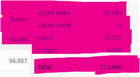

# Case study: Cross-repo orientation without opening source files

This document records a **concrete agent session** (Cursor + Nexus) that compared **two unrelated local Python checkouts** using **only structural queries** — no `read_file` / editor opens of source, README, docs, or concept notes in either target repository.

It is **illustrative (N=1)**, not a controlled benchmark. It complements the **TTRPG Studio A/B** in [`usage-metrics.md`](usage-metrics.md) by highlighting a different axis: **what “understanding” costs when you refuse naive full-tree text retrieval.**

---

## Task

**Compare** two repositories **conceptually**:

| Repository | Role in the study |
|------------|-------------------|
| **Aether VPN** (local checkout) | Backend-heavy tree: API routers, WebSocket, encyclopedia/chronicle/sandbox surfaces, sync tooling. |
| **TTRPG Studio** (local checkout) | Desktop-oriented tree: application services, resolver engine, PyQt workspaces, transcription/plugins. |

**Constraint:** Derive context from **structure** (Nexus map queries) only — **do not** read README, `/docs`, or concept folders in those repos.

---

## Method

From a Nexus development checkout:

- `python -m nexus.cli_opc map …`
- `python -m nexus.cli_opc locate …`
- `python -m nexus.cli_opc grep …`

…over each repo root (PowerShell-safe quoting for `-q`). **No** agent tool used to open files inside **Aether VPN** or **TTRPG Studio**.

**Note:** Nexus still **parses** `.py` files on disk during inference — the point is that the **LLM never received raw file bodies** for exploration; it received **bounded map slices** (symbols, calls, writes, paths).

---

## What the map showed (high level)

- **Aether (Python slice):** FastAPI-style **`aether_backend.api.*`** (encyclopedia, chronicle, sandbox, files, hooks), **`websocket_endpoint`** + chat logs, **`EncySyncManager`**, formula/method execution paths. VPN-specific strings did **not** dominate the Python map (product naming vs. visible code focus).
- **TTRPG Studio:** Central **`app.services.application`**, **`ResolverEngine`**, **`HostWorkspace` / `ClientWorkspace`**, Whisper/transcription services, plugin/webview UI — a **monolithic desktop** architecture vs. Aether’s **server + separate client folder** layout.

**Outcome:** A coherent **architectural comparison** (shared TTRPG-adjacent domain ideas; different deployment shape) without pasting repository text into the model context.

---

## Messlatte (measured sizes, 2026-04-03)

**What this is:** The **measuring stick** for **disk** and **developer-sliced `.py` mass** in this documentation. It **replaces** the earlier misleading **Aether↔TTRPG `.py`-byte league table** (wrongly implying comparable “repo smallness”). **Do not** invent parallel size figures elsewhere — **link here** or re-run the same methodology and update this section.

**When:** **2026-04-03** · **OS:** Windows · **Roots:** author’s local paths below · **same machine** as the cross-repo session described above.

**Method:** PowerShell recursive file walk. **Total** = sum of **all files** under the root. **`.py`†** = all `*.py` files whose path does **not** contain any of these **path segments:** `.git`, `venv`, `.venv`, `__pycache__`, `node_modules`, `dist`, `build` (developer-oriented slice, not “every byte in the product”).

| Checkout | Root | Total on disk (all files) | `.py` files† | `.py` total size† |
|----------|------|---------------------------|--------------|-------------------|
| **Nexus** (this product repo) | `F:\Nexus` | **~13.0 MB** | **243** | **~396 KB** |
| **Aether VPN** | `F:\Aether VPN` | **~605 MB** | **82** | **~507 KB** |
| **TTRPG Studio** | `F:\TTRPG Studio` | **~7.1 GB** | **4524** | **~65 MB** |

**Takeaway:** **Total clone size** and **“.py text you might naively paste”** are different axes. Aether VPN is **not** a “~7 MB repo” — that older shorthand in metrics copy referred to the **Nexus** checkout at a different time; this snapshot shows **Nexus ~13 MB**, **Aether ~605 MB**, **TTRPG ~7.1 GB** total, with **~65 MB** of `.py` alone on TTRPG after the excludes above.

**Nexus graph counts vs filesystem:** An inference run may still index **fewer** `.py` files than the table (ignore/deny rules, scan root, `app/` vs repo root). Example: [`token-efficiency.md`](token-efficiency.md) §3.2 cites **~153** `.py` indexed for one **TTRPG** smoke run — a **narrower scope** than “every `*.py` under `F:\TTRPG Studio`” in the table.

---

## Scale contrast (why “not nice optimization”)

**Messlatte:** All **disk** and **`.py`** claims below **must** match the **table in [§ Messlatte (measured sizes, 2026-04-03)](#messlatte-measured-sizes-2026-04-03)** — no fresh guesstimates. **Prompt** size is a different quantity (session totals, brief caps); do not conflate.

**TTRPG Studio:** **~65 MB** of `.py` in the measured slice is a concrete order of magnitude for **naive full-text orientation** of Python source alone — still on the order of **millions of tokens** if ingested wholesale (very rough **÷3–5 characters per token** for code), **before** reasoning, and **not** repeatable as a single context window.

**Aether VPN:** **~605 MB** total on disk vs **~507 KB** `.py` in the same counting rules shows how **non-Python / vendor / asset** mass dominates **clone size** while the **Python map** stays comparatively small.

**Nexus path:** Each query returns a **small structured slice**; the session’s **total** Cursor-reported tokens (~**110k** in one captured row, with **Cache Read** dominating) covered **orientation + synthesis + rules + history** — not “**~65 MB** of `.py` in the prompt.”

Interpretation: the win is not merely “compression” of text — it is a **representation shift**: **query a graph-shaped index**, then open files **only when deliberately targeted** (this run: **zero** such opens in the two subject repos).

---

## Billing screenshot (same session family)

One Cursor usage row for this style of session showed approximately:

- **Total** ~**110k** tokens  
- **Cache Read** ~**85%** of total  
- **Input** / **Output** much smaller than total  

That pattern matches **large recycled context** (rules, prior turns, tool outputs), not “Nexus printed megatokens.” The qualitative claim stands: **structural retrieval avoids shipping whole-repo text to the model.**

Canonical copy (repo): [`docs/assets/usage-metrics/cursor-cross-repo-orientation-110k.png`](assets/usage-metrics/cursor-cross-repo-orientation-110k.png)



---

## Honesty constraints

- **Heuristic map:** Missing edges, noisy tags, and query sensitivity still apply — see [`README.md`](../README.md) “Repo health & known limitations.”
- **Session total ≠ Nexus stdout only:** Dashboard **Total** includes the **whole** agent conversation, not just CLI output.
- **Cross-repo / size claims:** File and byte counts depend on **roots and ignore rules**; **total clone size ≠ “Python scanned” size**. Do not treat ad-hoc `.py` totals as comparable across products without defining scope.

---

## Related docs

- [`usage-metrics.md`](usage-metrics.md) — Cursor dashboards, controlled TTRPG A/B, gallery caveats  
- [`token-efficiency.md`](token-efficiency.md) — CLI metrics, amortization  
- [`nexus-scaling-law.md`](nexus-scaling-law.md) — informal scaling argument  

---

## Reproduce (shape only)

```powershell
$env:PYTHONPATH = "path\to\nexus\src"
python -m nexus.cli_opc map -q "package layout modules" "F:\YourRepo"
python -m nexus.cli_opc locate -q "your topic" "F:\YourRepo"
```

Use [`docs/tutorial-nexus-opc-isa.md`](tutorial-nexus-opc-isa.md) for opcode details and `--dry-run`.
