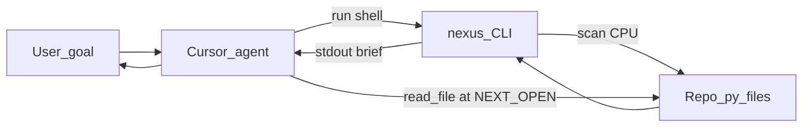

# How an agent uses Nexus — and how that looks in Cursor

This page is a **fixed explanation anchor**: no marketing, just **roles**, **data flow**, and **where things live in Cursor**.

---

## Roles

| Part | Role |
|------|------|
| **You** | Goal + repo open in Cursor. |
| **Cursor agent** (Composer / Agent mode) | LLM + tools: can run **terminal commands**, **read files**, edit — depending on your Cursor version and settings. |
| **Nexus** (CLI on **your** machine) | Commands **`nexus-opc`** (fixed **opcode** pipelines — see **[`tutorial-nexus-opc-isa.md`](tutorial-nexus-opc-isa.md)**), **`nexus`**, **`nexus-grep`**, **`nexus-policy`**, **`nexus-cursor-rules`**, optional **`nexus-console`**: build an **inference map** from `.py`, return **bounded** text (brief, names, policy slice). Install the **`nexus-inference`** package; there is no `nexus-inference` executable. |
| **Your codebase** | Files on disk; Nexus reads them during a run; the agent reads **specific** paths when needed. |

The **model does not “have” Nexus inside the weights**. Nexus runs as a **subprocess** when the agent (or you) invokes the CLI. The model only sees **whatever is returned** (terminal capture) or what you paste.

---

## The usual loop



1. **Agent** chooses a **Nexus command** — preferably **`nexus-opc locate`** / **`nexus-opc grep`** / **`nexus-opc policy`** so flags are not invented; then **`nexus -q`** with small **`--max-symbols`** for **`impact` / `why` / mutation** narratives, or **`nexus --perspective …`** when opcodes do not fit (same vocabulary as the library and Inference Console; see **`docs/cli-perspective.md`** and **`docs/tutorial-nexus-opc-isa.md`**).  
2. **Shell** runs on the **workspace** (usually repo root). Nexus **scans** and prints a **short** structured answer.  
3. **Agent** uses **`NEXT_OPEN`** / symbol paths from the output to **open only those files** (or slices), instead of searching the whole tree with `rg`.  
4. Repeat with a **tighter `-q`** or another subpath until the task is done.

So: **search / structure discovery** is **outsourced** to Nexus on the CPU; the **model** spends context on **decisions** and **targeted reads**, not on **blind file churn**.

---

## What “full auto” tends to mean here

With **agent + terminal tool**, the model can **chain many Nexus calls** and **file reads** in one session — e.g. several queries or parallel follow-ups — because it no longer needs to **discover** the graph by reading everything. That matches reports of **many tasks in one go**: the **bottleneck** (where is what?) moves off the LLM context and onto **local** Nexus runs.

---

## How this looks **in Cursor**

### 1. Project rules (steer the agent)

Cursor loads rules from **`.cursor/rules/*.mdc`** in the **open project**.

For Python repos, install the bundled rule:

```bash
cd /path/to/your/python/project
nexus-cursor-rules install
```

That adds **`nexus-over-grep.mdc`**, which tells the agent to prefer **`nexus-grep` / `nexus`** over broad **`grep`/`rg`** for orientation, and documents **`--perspective`** as the explicit CLI contract. Source in this repo: [`src/nexus/cursor_rules/nexus-over-grep.mdc`](../src/nexus/cursor_rules/nexus-over-grep.mdc). Perspective matrix: [`docs/cli-perspective.md`](cli-perspective.md).

Optional: same rule under **`%USERPROFILE%\.cursor\rules\`** for all projects.

### 2. Terminal panel

When the **agent runs a command**, you see it in Cursor’s **terminal** — same as running:

```bash
nexus-grep . -q "mutation" --max-symbols 20
```

or (Windows, without `nexus` on PATH):

```powershell
$env:PYTHONPATH = "C:\path\to\Nexus\src"
python -m nexus.cli_grep . -q "mutation" --max-symbols 20
```

**Working directory** matters: run from **repo root** (or pass `src/yourpkg` explicitly).

### 3. `AGENTS.md` in the repo

Many teams add an **`AGENTS.md`** at the project root with **copy-paste commands** for agents. Nexus ships a template for **using** Nexus in any Python repo: **[`AGENTS.md`](../AGENTS.md)** in this repository — you can **adapt** it in **your** app repo.

### 4. What you see as a human

- **Chat / Composer**: the model’s plan and reasoning.  
- **Terminal**: Nexus stdout (and optional stderr control header).  
- **Editor**: jumps to files the agent opened after **`NEXT_OPEN`** or symbol paths.

---

## Install reminder (agent host machine)

| Situation | What to do |
|-----------|------------|
| Nexus on PATH | **`nexus`**, **`nexus-grep`**, **`nexus-policy`**, … work as-is (from package **`nexus-inference`**). |
| Editable clone | `pip install -e /path/to/Nexus` or `pipx install -e …`. |
| No install | Set **`PYTHONPATH`** to `…/Nexus/src`, use **`python -m nexus …`** / **`python -m nexus.cli_grep …`**. |

Agents do not need the **Inference Console** (`nexus-console`); that is optional for humans. The **same** map powers CLI and GUI.

---

## Limits (honest)

- **`-q` is heuristic text**, not free-form natural language inside Nexus itself; the **agent** picks the next string (e.g. `"runtime mutation"`).  
- **Static graph:** **AST + heuristics** — dynamic Python, indirection, and frameworks can produce **gaps** or **false links**; **confidence** and mutation hints are **hints**, not proofs.  
- **Default CLI mode** rebuilds the map **per `nexus` invocation** (`fresh`); “one scan forever” applies more to a **long-lived** UI session or **cached** modes (opt-in; see **SECURITY.md**).  
- **Full `--json`** exports are sensitive — do not commit or paste wholesale (see **[`SECURITY.md`](../SECURITY.md)**).

---

## Related docs

| Doc | Why |
|-----|-----|
| [`AGENTS.md`](../AGENTS.md) | Commands, PowerShell, control header, policy |
| [`TUTORIAL.md`](../TUTORIAL.md) | Tutorial hub |
| [`docs/tutorial-nexus-cli-and-ui.md`](tutorial-nexus-cli-and-ui.md) | CLI + Console story |
| [`docs/token-efficiency.md`](token-efficiency.md) | Caps and defaults |
| [`extras/cursor-rules/README.txt`](../extras/cursor-rules/README.txt) | Cursor rule install notes |
