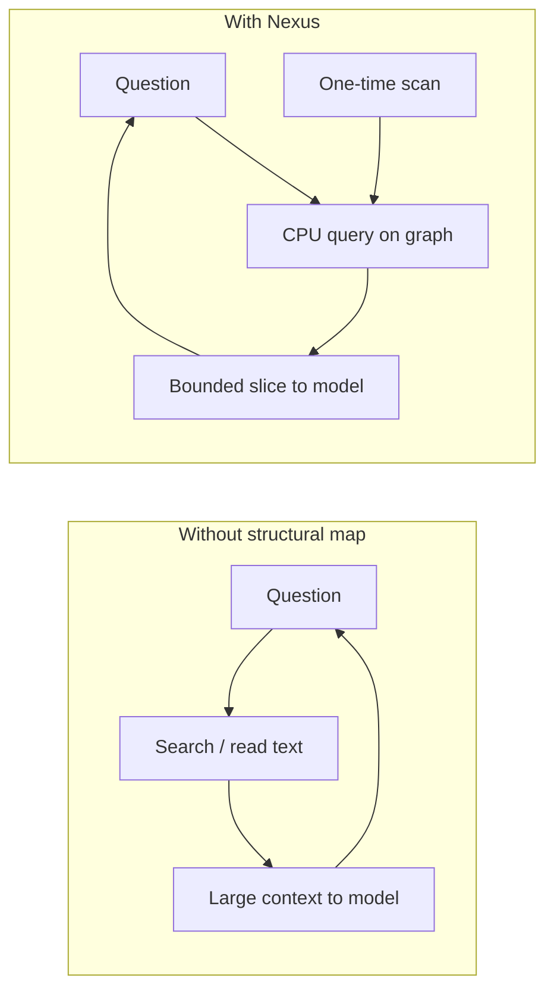

# Nexus and the scaling of agent cost (informal “scaling law”)

This note states an **architectural consequence** of Nexus, not a formal theorem. It explains **why** the **relative** win from structural retrieval tends to **grow with repository size** — consistent with the **controlled analysis** capture on a large checkout in **[`usage-metrics.md`](usage-metrics.md)** (TTRPG Studio A/B), and with the **small-repo** captures where the effect is **marginal**.

**Messlatte:** Measured **on-disk** and **`.py`** scale for **Nexus vs TTRPG vs Aether** (so “large” and “small” are not hand-wavy) lives in **[`case-study-cross-repo-orientation.md` § Messlatte](case-study-cross-repo-orientation.md#messlatte-measured-sizes-2026-04-03)**.

---

## 1. What is being scaled

- **N** — size of the primary codebase slice the agent cares about (files, symbols, edges — order-of-magnitude stand-in for “how big the haystack is”).
- **Agent cost** (for orientation / “where does this live?”) — roughly **tokens, turns, and wide context** shipped to the model while it **searches** the tree, not while it **implements** features.

Nexus does **not** remove reasoning, patching, or deliberate file reads. It targets **search-shaped** spend: grep-shaped walls, exploratory full-file churn, and repeated re-loading of the same broad context.

---

## 2. Classical loop (without a structural map)

In a naive agent loop, each “where is it?” question often behaves as if cost scales with:

- the **effective search space** (how much of the repo must be touched or summarized to reduce uncertainty), and  
- the **number of iterations** until confidence is high enough to act.

Informally:

```text
Orientation cost  ~  f(N) × (number of search / read iterations)
```

where **f(N)** grows with **N** because more files and more indirection increase **noise** and **branching** (“which layer? which symbol?”). That growth need not be strictly linear; in practice, **uncertainty-driven loops** make the behavior feel **worse than linear** in **N** for bad retrieval habits.

---

## 3. Nexus loop (amortized structure)

Nexus builds an **inference graph once per scan** (CPU / local), then answers follow-ups with **bounded structural projections** (`nexus-grep`, `nexus -q`, caps, perspectives).

Informally:

```text
One-time cost     ~  O(N)   (parse + infer — grows with repo size)
Per-query cost    ~  O(k)   (brief / slice — k capped by CLI policy, not by N)
```

**Important:** this is **not** a claim that every query is constant-time in the implementation; it is a claim about **what you ask the model to read**: **k** is **policy-bounded** (e.g. `--max-symbols`, `nexus-policy` stages), while **raw text search** in a huge tree is not similarly bounded unless the human or agent enforces it.

So **cost shifts**:

- from **“pay again on every question in unstructured text space”**  
- to **“pay once for structure locally, then pay a bounded slice per question.”**



---

## 4. Why the *advantage* grows with repo size

For **small N**:

- The unstructured search space is already small; **even naive** exploration may not blow the budget.  
- Nexus is still useful for **precision** and **ergonomics**, but **total token deltas** can look **flat** (see small-checkout rows in **[`usage-metrics.md`](usage-metrics.md)**).

For **large N**:

- **Noise and branching** explode: more modules, more names, more dead ends.  
- Without a map, the agent’s **iteration count** and **context width** rise — especially **Cache Read** / re-injected wide context across turns (see discussion in **`usage-metrics.md`**).  
- Nexus acts simultaneously as **compressor** (slice instead of wall of text), **filter** (symbols and edges), and **navigator** (where to open next).

So the observation:

> **The larger the repo, the larger the *relative* benefit** — for orientation — is **expected** under this architecture: you are **trading unbounded text search in N** for **bounded structural answers** after an amortized build.

That is **not** luck; it is how **amortized indexing** interacts with **LLM context economics**.

---

## 5. What this is *not*

- **Not a formal Big-O proof** of end-to-end agent behavior (tools, prompts, and humans dominate variance).  
- **Not** “Nexus makes all work O(1).” Implementation work, tests, and refactors still scale with change size.  
- **Not** a guarantee against agent loops: bad policies can still waste turns even with Nexus.  
- **Not** replacing embeddings or search — it changes **what** you search: **structure first**, text **where it matters**.

Empirical **session totals** mix **task type** (analysis vs build) with **retrieval**; see the **fair vs unfair** table in **`usage-metrics.md`**. The **TTRPG Studio** pair is the documented **controlled analysis** anchor; gallery rows are **illustrative** and **confounded**.

---

## 6. One-line summary

**Nexus moves orientation cost from repeated unstructured exploration in N to a one-time structural build plus bounded per-query slices — so the win vs naive text search should grow with N until other bottlenecks dominate.**

---

## See also

- **[`token-efficiency.md`](token-efficiency.md)** — amortization, caps, and why totals alone mislead (§1.1).  
- **[`usage-metrics.md`](usage-metrics.md)** — real dashboard captures, methodology, and caveats.  
- **[`nexus-agent-cursor.md`](nexus-agent-cursor.md)** — recommended agent loop (tiering).
