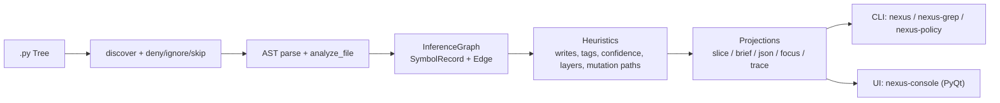

# Nexus — Repository-Analyse

**Sprache:** Deutsch · **English:** [repository-analysis.md](repository-analysis.md)

**Für wen:** Leserinnen und Leser, die das Projekt **Mechanicals-Nexus / nexus-inference** als Ganzes verstehen wollen — Architektur, Oberflächen, Risiken und Reifegrad — ohne zuerst den Quellcode durchzugehen.

**Hinweis:** Diese Seite ist eine **strukturierte Bestandsaufnahme** (Executive Summary + Tiefe). Sie ergänzt die Kurz-Pitches in [`NEXUS-REPORT.md`](../NEXUS-REPORT.md) und [`README.md`](../README.md). Der File-Tree unten listet referenzierte Pfade; Binärassets (PNG) werden als Ordner genannt, nicht einzeln vollständig inventarisiert.

---

## Executive Summary

Das Repository implementiert ein Python-Paket namens **nexus-inference**, das eine **Inference Map** (strukturierte Repräsentation) aus Python-Quellcode erzeugt: Symbole (Funktionen/Klassen/Methoden), Call-Edges, heuristische Read/Write- und Mutationshinweise, **Layer**-Klassifikation sowie einen **Confidence**-Score. Ziel ist, Orientierung und Impact-/Mutationsfragen in großen Codebasen nicht über breit streuende Textsuche (`grep`/`rg`) und „File-Browsing im Prompt“ zu lösen, sondern über **lokal erzeugte Struktur**, die anschließend **budgetiert** (capped) in LLM- oder Human-Workflows eingespeist wird. Das zentrale Nutzenversprechen ist damit eher **„Suche/Navigation aus dem Prompt auf die CPU verlagern“** als reine Textkompression.

**Kernfunktionen und Oberflächen** sind klar getrennt:

1. Scan/Graph-Aufbau (`attach` / `scan`)
2. Query-/Slicing-Logik und perspektivische Projektionen (**Perspectives**)
3. Ausgabeoberflächen: **CLI** (`nexus`, `nexus-grep`, `nexus-policy`, …) und optional ein **PyQt-basiertes GUI** („Inference Console“)

Das Repository enthält zudem konkrete **Governance-/Safety-Mechaniken** (z. B. `.nexusdeny`, `.nexusignore`, Output-Caps, Control-Header) und eine explizite **Security-Positionierung**, die Inference-Exporte als potentiell sensibel klassifiziert ([`SECURITY.md`](../SECURITY.md)).

**Reifegrad / Engineering-Signal:** CI (Windows + Ubuntu, Python 3.10 / 3.12) mit Lint/Format über **Ruff** und Tests via **Pytest**. Eine Coverage-Untergrenze ist konfiguriert (**Fail-under 52 %**), was für ein frühes Beta-Paket realistig ist, aber auch zeigt, dass Testabdeckung als „mindestens Baseline“ und nicht als maximale Absicherung priorisiert wird.

**Wesentliche Risiken:**

| Risiko | Kurz |
|--------|------|
| **Heuristik** | AST-basiert, bei dynamischen Python-Idiomen begrenzt; im Repo offen benannt. |
| **Exporte / Cache** | Können Architektur- und Pfadinformationen preisgeben; explizit als Security-Thema behandelt (opt-in Caching; `.gitignore`; `.nexusdeny` außerhalb des Scan-Roots). |
| **Lizenz GUI** | Kernpaket **MIT**; optionales GUI hängt von **PyQt6** ab (dual: GPLv3 oder kommerziell) — für Distributionsszenarien compliance-relevant. |

---

## Zweck und Lösungsansatz

Das Repository positioniert Nexus als **Inference Layer** zwischen Quellcode und Reasoning-Systemen: Aus einem Baum von `.py`-Dateien wird eine strukturierte Karte erzeugt, die statt flacher Trefferlinien Symbolkarten, Call-Beziehungen, Mutations-/State-Touching-Hinweise, Confidence und Layer liefert.

**Tiering** (bewusst dokumentiert):

| Stufe | Idee |
|-------|------|
| **Thin first** | `nexus-grep` oder `--names-only` / `--annotate` → kleine Kandidatenmenge (token-schonend). |
| **Read slices** | Danach gezielte Dateislices (`NEXT_OPEN`, `file:line`). |
| **Deeper only if needed** | Spezialabfragen (`impact`, `why`, Mutation Chain, Core Flow) über `nexus -q` / `llm_brief`. |
| **Full export selten** | `--json` (Vollgraph) als sensibler Sonderfall. |

Wichtig in der Repo-Argumentation: Nexus wird **nicht** primär als „Token-Kompressor“ verkauft, sondern als **Umverteilung der Kosten**: einmaliger lokaler Scan (CPU) vs. wiederholte Prompt-Kontextkosten. Details und methodische Warnungen (fair vs. unfair Vergleiche): [`token-efficiency.md`](token-efficiency.md), [`usage-metrics.md`](usage-metrics.md).

---

## Architektur und Datenfluss

### High-Level-Pipeline

1. **Discovery & Parsing:** `.py`-Dateien werden entdeckt (Skip-/Deny-Regeln), gelesen und AST-geparst.
2. **Graph Construction:** Aus Symbolen/Calls/Reads/Writes wird ein `InferenceGraph` aufgebaut (Nodes = `SymbolRecord`, Edges = `Edge`).
3. **Heuristische Inferenz:** Indirekte/transitive Writes, Tags, Confidence, Layer, Mutation Paths (Ranking).
4. **Projection / Views:** Query-Slices, Perspectives, LLM-Briefs, JSON-Slices, Focus Graph, Mutation Trace.
5. **Surfaces:** CLI und optional GUI.

**Die These „one map, two surfaces“** (CLI und GUI teilen dieselbe Pipeline, keine zweite Inferenz in der UI) ist im Code so umgesetzt: die GUI nutzt dieselben Projections (`render_perspective`, `build_json_slice`, `trace_mutation`).



### Zentrale Datenmodelle

| Modell / Typ | Ort | Rolle |
|--------------|-----|--------|
| `InferenceGraph` | `src/nexus/core/graph.py` | In-Memory-Container: Root, Dateiliste, Symbole, Kanten; Export JSON; LLM-Brief; `trace_mutation`, Finder. |
| `SymbolRecord` | `src/nexus/core/models.py` | Node: Name/Kind/Ort + Reads/Writes/Calls + Heuristikfelder (Tags, Confidence, Layer, Mutation Paths). |
| `Edge` | `src/nexus/core/models.py` | Kante (v. a. `type="calls"`). |
| `FileRecord` | `src/nexus/core/models.py` | Dateieintrag inkl. `redacted` (`.nexusignore`) — „sichtbar, nicht gemappt“. |

### Inferenz-Heuristiken (Kurz)

- **AST-Analyse** (`ast_analyze`): Symbole, reads/writes/calls/constructs; dynamische Calls / lokale Zuweisungen als Flags.
- **Import-/Alias-Auflösung** (`resolution/imports`): `import x as y`, `from a.b import c as d`, relative Imports; `from … import *` mit Merge gegen exportierte Top-Level-Symbole (`unknown-import` wenn unklar).
- **Call-Target-Resolution** (`scanner`): Same-File-Priorität, Suffix-Matches, einfache Basisklassen-Weiterleitung; Ambiguität → Tag `ambiguous-call`.
- **Write-Propagation:** indirekte Writes aus Callees; **transitive** Writes per Fixpunkt über den Call-Graph.
- **Tags & Confidence:** z. B. `mutator`, `direct-mutation`, `delegate`, `leaf`, `dynamic-call`, `local-write` → Score in [0, 1].
- **Layering:** Pfadheuristiken (`analysis/layers.py`).
- **Mutation Paths:** gerankte Pfade zu Symbolen mit direkten Writes (`analysis/mutation_chains.py`).

### Module → Schichten (vereinfacht)

| Schicht | Beispielpfade |
|---------|----------------|
| **Parsing** | `parsing/loader.py`, `parsing/ast_analyze.py`, `parsing/nexus_deny.py`, `parsing/nexus_ignore.py` |
| **Resolution** | `resolution/imports.py` |
| **Core** | `core/models.py`, `core/graph.py` |
| **Heuristics** | `scanner.py`, `analysis/layers.py`, `analysis/mutation_chains.py` |
| **Output** | `output/llm_format.py`, `output/llm_query_modes.py`, `output/perspective.py`, `output/inference_projection.py`, `output/json_export.py` |
| **Policy** | `policy/profile.py`, `policy/planner.py`, `default_profile.v2.yaml` |
| **Surfaces** | `cli.py`, `cli_grep.py`, `cli_policy.py`, `ui/*` |

---

## Repository-Struktur (verifizierbarer Überblick)

```
Mechanicals-Nexus---Inference-Control/
  README.md
  TUTORIAL.md
  AGENTS.md
  NEXUS-REPORT.md
  SECURITY.md
  LICENSE
  pyproject.toml
  .gitignore
  .github/workflows/ci.yml

  src/nexus/
    __init__.py
    __main__.py
    cli.py
    cli_grep.py
    cli_policy.py
    cursor_rules_cli.py
    control_header.py
    inference_modes.py
    scanner.py
    analysis/
    core/
    parsing/
    resolution/
    output/
    policy/
    cursor_rules/
    ui/

  tests/
  docs/
    … (weitere .md, assets/, usage-metrics PNGs)
  console tutorial/
  extras/cursor-rules/
```

---

## Oberflächen (CLI, Policy, UI)

| Oberfläche | Module | Rolle |
|------------|--------|--------|
| `nexus` | `cli.py`, `output/perspective.py` | Haupt-Frontend: Brief, JSON, Names-only, Traces, `--perspective`. |
| `nexus-grep` | `cli_grep.py` | Slice → Suche nur in relevanten Dateien; blockiert Spezialqueries absichtlich. |
| `nexus-policy` | `cli_policy.py`, `policy/*` | Safe-by-default: Scope, Caps, Stages, Output-Budgets. |
| `nexus-console` | `ui/*` | Optionales GUI (`[ui]`); nutzt dieselben Projections. |

---

## Abhängigkeiten, Packaging, Lizenz

- **Build:** Hatchling; Paketname **nexus-inference**; Python **>= 3.10**.
- **Runtime:** PyYAML (Policy-Profile, `safe_load`).
- **Optional UI:** PyQt6 — **GPLv3 oder Commercial** (Riverbank), nicht LGPL.
- **Projektlizenz:** **MIT** (Root `LICENSE`).

---

## Codequalität, Tests, CI

- **Stil:** Ruff (u. a. Zeilenlänge 100, Target Python 3.10), weit verbreitete Typannotationen.
- **Komplexität:** Konzentriert in `scanner.py` (Scan, Auflösung, Propagation) — Haupt-ROI für gezielte Tests.
- **Tests:** u. a. epistemische Trennung `heuristic_slice` vs. `llm_brief` bei Spezialqueries; Qt-freie Projections in `output/inference_projection.py`.
- **CI:** Ubuntu + Windows, Python 3.10 und 3.12; Ruff + Pytest mit Coverage-Floor **52 %**.

---

## Sicherheit und Datenschutz (Kurz)

[`SECURITY.md`](../SECURITY.md) klassifiziert Graph-Exporte und Briefings als potentiell hoch sensitiv („Source plus Architektur-Index“).

| Mechanismus | Zweck |
|-------------|--------|
| `.nexusdeny` (außerhalb Scan-Root) | Hartes Verbergen von Subtrees bei Discovery. |
| `.nexusignore` (im Root) | Pfade sichtbar, Inhalt nicht gelesen / nicht gemappt. |
| `.nexus-skip` | Verzeichnis + Unterbaum überspringen. |
| Control Header (`--control-header` / Env) | Begrenzte Konfig-Observability (stderr). |
| Cache-Opt-in (`persistent` / `hybrid`) | Explizit als security-sensibel dokumentiert. |

---

## Use Cases und Zielgruppe

**Gut geeignet:** Onboarding, Impact-Analyse (`impact`), Mutations-/State-Pfade, Agent-Workflows mit Budget, Governance mit `nexus-policy` + Deny/Ignore.

**Weniger geeignet:** starke Metaprogrammierung / Runtime-Dynamik; Nicht-Python-Repos (keine AST-Inferenz).

---

## Empfohlene nächste Schritte (Roadmap-Skizze)

| Horizont | Maßnahme |
|----------|-----------|
| **Kurz** | Scanner-/Import-Tests ausbauen; SECURITY um Cache-Best-Practices; klarere CLI-Fehler bei `--mode` / `--perspective`. |
| **Mittel** | `follow_imports` / Recall in modularen Repos; inkrementeller Scan auf Basis vorhandener Fingerprint-Idee; standardisierte Heuristik-Provenance (über `--debug-perspective` hinaus). |
| **Lang** | Plugin-/Adapter für Framework-Heuristiken; andere Sprachen (z. B. Tree-sitter) wären große Produktentscheidung. |

---

## Annahmen dieser Analyse

Eine bytegenau vollständige Aufzählung aller Binärdateien ist hier **nicht** Ziel; der Tree ist für **Text-/Code-Pfade und dokumentierte Assets** repräsentativ. Für die **kanonische** API und CLI-Verhalten immer **`README.md`**, [`AGENTS.md`](../AGENTS.md) und die verlinkten `docs/*` heranziehen.

---

*Stand: Analyse-Seite für Repository-Verständnis; inhaltlich an den Nexus-Quellbaum und die Doku im selben Repo gebunden.*
