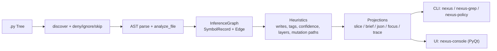

# Nexus — Repository analysis

**Language:** English · **Deutsch:** [repository-analyse.md](repository-analyse.md)

**Audience:** Readers who want to understand the **Mechanicals-Nexus / nexus-inference** project end to end — architecture, surfaces, risks, and maturity — before diving into the source.

**Note:** This page is a **structured stock-take** (executive summary + depth). It complements the shorter pitches in [`NEXUS-REPORT.md`](../NEXUS-REPORT.md) and [`README.md`](../README.md). The file tree below lists referenced paths; binary assets (PNGs) are named at folder level, not exhaustively inventoried per file.

---

## Executive summary

This repository implements a Python package called **nexus-inference** that builds an **inference map** (a structured representation) from Python source: symbols (functions/classes/methods), call edges, heuristic read/write and mutation hints, **layer** classification, and a **confidence** score. The goal is to answer orientation and impact/mutation questions in large codebases **without** relying mainly on broad text search (`grep`/`rg`) and “file-browsing in the prompt”, but on **locally computed structure** that is then fed into LLM or human workflows in a **budgeted** (capped) way. The core value proposition is **moving search/navigation work from the prompt to the CPU**, not pure text compression.

**Core capabilities and surfaces** are clearly separated:

1. Scan / graph build (`attach` / `scan`)
2. Query / slicing logic and perspective-based projections (**Perspectives**)
3. Output surfaces: **CLI** (`nexus`, `nexus-grep`, `nexus-policy`, …) and an optional **PyQt** GUI (“Inference Console”)

The repo also ships concrete **governance / safety** mechanics (e.g. `.nexusdeny`, `.nexusignore`, output caps, control header) and an explicit **security stance** that treats inference exports as potentially sensitive ([`SECURITY.md`](../SECURITY.md)).

**Maturity / engineering signal:** CI on **Windows + Ubuntu** with **Python 3.10 / 3.12**, lint/format via **Ruff**, tests via **Pytest**. A coverage floor is configured (**fail-under 52%**), which is realistic for an early beta package but also signals that test coverage is a **baseline floor**, not maximum hardening.

**Main risks:**

| Risk | Short |
|------|--------|
| **Heuristics** | AST-based; limited for dynamic Python idioms; acknowledged in-repo. |
| **Exports / cache** | Can reveal architecture and path information; treated as a security topic (opt-in caching; `.gitignore`; `.nexusdeny` outside the scan root). |
| **GUI license** | Core package **MIT**; optional GUI depends on **PyQt6** (dual: GPLv3 or commercial) — compliance-relevant for some distribution scenarios. |

---

## Purpose and approach

The repository positions Nexus as an **inference layer** between source and reasoning systems: from a tree of `.py` files it produces a structured map with symbol cards, call relationships, mutation/state-touching hints, confidence, and layers — instead of only flat hit lines.

**Tiering** (documented by design):

| Stage | Idea |
|-------|------|
| **Thin first** | `nexus-grep` or `--names-only` / `--annotate` → small candidate set (token-frugal). |
| **Read slices** | Then targeted file slices (`NEXT_OPEN`, `file:line`). |
| **Deeper only if needed** | Special queries (`impact`, `why`, mutation chain, core flow) via `nexus -q` / `llm_brief`. |
| **Full export rarely** | `--json` (full graph) as a sensitive special case. |

Important in the repo narrative: Nexus is **not** sold mainly as a “token compressor” but as **cost relocation**: one local scan (CPU) vs. repeated prompt context cost. Details and methodological caveats (fair vs. unfair comparisons): [`token-efficiency.md`](token-efficiency.md), [`usage-metrics.md`](usage-metrics.md).

---

## Architecture and data flow

### High-level pipeline

1. **Discovery & parsing:** discover `.py` files (skip/deny rules), read and AST-parse them.
2. **Graph construction:** build an `InferenceGraph` from symbols/calls/reads/writes (nodes = `SymbolRecord`, edges = `Edge`).
3. **Heuristic inference:** indirect/transitive writes, tags, confidence, layers, mutation paths (ranking).
4. **Projection / views:** query slices, perspectives, LLM briefs, JSON slices, focus graph, mutation trace.
5. **Surfaces:** CLI and optional GUI.

**The “one map, two surfaces” claim** (CLI and GUI share the same pipeline; no second inference engine in the UI) is implemented that way: the GUI uses the same projections (`render_perspective`, `build_json_slice`, `trace_mutation`).



### Core data models

| Model / type | Location | Role |
|--------------|----------|------|
| `InferenceGraph` | `src/nexus/core/graph.py` | In-memory container: root, file list, symbols, edges; JSON export; LLM brief; `trace_mutation`, finders. |
| `SymbolRecord` | `src/nexus/core/models.py` | Node: name/kind/location + reads/writes/calls + heuristic fields (tags, confidence, layer, mutation paths). |
| `Edge` | `src/nexus/core/models.py` | Edge (mostly `type="calls"`). |
| `FileRecord` | `src/nexus/core/models.py` | File entry incl. `redacted` (`.nexusignore`) — “visible, not mapped”. |

### Inference heuristics (short)

- **AST analysis** (`ast_analyze`): symbols, reads/writes/calls/constructs; dynamic calls / local assignments as flags.
- **Import / alias resolution** (`resolution/imports`): `import x as y`, `from a.b import c as d`, relative imports; `from … import *` merged against exported top-level symbols (`unknown-import` when unclear).
- **Call-target resolution** (`scanner`): same-file priority, suffix matches, simple base-class forwarding; ambiguity → tag `ambiguous-call`.
- **Write propagation:** indirect writes from callees; **transitive** writes via fixpoint over the call graph.
- **Tags & confidence:** e.g. `mutator`, `direct-mutation`, `delegate`, `leaf`, `dynamic-call`, `local-write` → score in [0, 1].
- **Layering:** path heuristics (`analysis/layers.py`).
- **Mutation paths:** ranked paths to symbols with direct writes (`analysis/mutation_chains.py`).

### Modules → layers (simplified)

| Layer | Example paths |
|-------|----------------|
| **Parsing** | `parsing/loader.py`, `parsing/ast_analyze.py`, `parsing/nexus_deny.py`, `parsing/nexus_ignore.py` |
| **Resolution** | `resolution/imports.py` |
| **Core** | `core/models.py`, `core/graph.py` |
| **Heuristics** | `scanner.py`, `analysis/layers.py`, `analysis/mutation_chains.py` |
| **Output** | `output/llm_format.py`, `output/llm_query_modes.py`, `output/perspective.py`, `output/inference_projection.py`, `output/json_export.py` |
| **Policy** | `policy/profile.py`, `policy/planner.py`, `default_profile.v2.yaml` |
| **Surfaces** | `cli.py`, `cli_grep.py`, `cli_policy.py`, `ui/*` |

---

## Repository layout (verifiable overview)

```
Mechanicals-Nexus---Inference-Control/
  README.md
  TUTORIAL.md
  AGENTS.md
  NEXUS-REPORT.md
  SECURITY.md
  LICENSE
  pyproject.toml
  .gitignore
  .github/workflows/ci.yml

  src/nexus/
    __init__.py
    __main__.py
    cli.py
    cli_grep.py
    cli_policy.py
    cursor_rules_cli.py
    control_header.py
    inference_modes.py
    scanner.py
    analysis/
    core/
    parsing/
    resolution/
    output/
    policy/
    cursor_rules/
    ui/

  tests/
  docs/
    … (more .md, assets/, usage-metrics PNGs)
  console tutorial/
  extras/cursor-rules/
```

---

## Surfaces (CLI, policy, UI)

| Surface | Modules | Role |
|---------|---------|------|
| `nexus` | `cli.py`, `output/perspective.py` | Main frontend: brief, JSON, names-only, traces, `--perspective`. |
| `nexus-grep` | `cli_grep.py` | Slice → search only in relevant files; special queries intentionally blocked. |
| `nexus-policy` | `cli_policy.py`, `policy/*` | Safe-by-default: scope, caps, stages, output budgets. |
| `nexus-console` | `ui/*` | Optional GUI (`[ui]`); same projections as CLI. |

---

## Dependencies, packaging, license

- **Build:** Hatchling; package name **nexus-inference**; Python **>= 3.10**.
- **Runtime:** PyYAML (policy profiles, `safe_load`).
- **Optional UI:** PyQt6 — **GPLv3 or commercial** (Riverbank), not LGPL.
- **Project license:** **MIT** (root `LICENSE`).

---

## Code quality, tests, CI

- **Style:** Ruff (incl. line length 100, target Python 3.10), widespread type annotations.
- **Complexity:** Concentrated in `scanner.py` (scan, resolution, propagation) — main ROI for targeted tests.
- **Tests:** e.g. epistemic separation of `heuristic_slice` vs. `llm_brief` for special queries; Qt-free projections in `output/inference_projection.py`.
- **CI:** Ubuntu + Windows, Python 3.10 and 3.12; Ruff + Pytest with coverage floor **52%**.

---

## Security and privacy (short)

[`SECURITY.md`](../SECURITY.md) classifies graph exports and briefings as potentially highly sensitive (“source plus an architecture index”).

| Mechanism | Purpose |
|-----------|---------|
| `.nexusdeny` (outside scan root) | Hard-hide subtrees from discovery. |
| `.nexusignore` (at root) | Paths visible; content not read / not mapped. |
| `.nexus-skip` | Skip directory + subtree. |
| Control header (`--control-header` / env) | Bounded config observability (stderr). |
| Cache opt-in (`persistent` / `hybrid`) | Documented as security-sensitive. |

---

## Use cases and audience

**Good fit:** onboarding, impact analysis (`impact`), mutation/state paths, agent workflows with budgets, governance with `nexus-policy` + deny/ignore.

**Poor fit:** heavy metaprogramming / runtime dynamism; non-Python repos (no AST inference here).

---

## Suggested next steps (roadmap sketch)

| Horizon | Item |
|---------|------|
| **Near term** | Expand scanner/import tests; SECURITY cache best practices; clearer CLI errors for `--mode` / `--perspective`. |
| **Medium term** | `follow_imports` / recall in modular repos; incremental scan building on fingerprint ideas; standardized heuristic provenance (beyond `--debug-perspective`). |
| **Long term** | Plugin/adapters for framework heuristics; other languages (e.g. Tree-sitter) would be a major product decision. |

---

## Scope of this analysis

A byte-perfect inventory of every binary file is **not** the goal; the tree is representative for **text/code paths and documented assets**. For **canonical** API and CLI behavior, use **`README.md`**, [`AGENTS.md`](../AGENTS.md), and the linked `docs/*` files.

---

*This page tracks the Nexus source tree and documentation in the same repository.*
