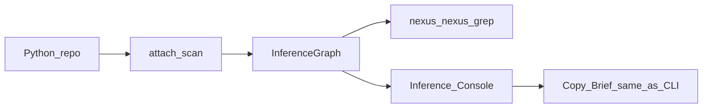

# Nexus tutorial: one map, two surfaces (CLI + UI)

This page is the **single walkthrough** for how Nexus works **whether you use the terminal or the Inference Console**. The screenshots come from the **Nexus Inference Console**; every step has a **direct CLI equivalent** — same scan, same graph, same functions — so what you **see**, what you **print**, and what you **paste into an LLM** stay aligned.

**TL;DR**

| Idea | Detail |
|------|--------|
| **Invariant** | One **`InferenceGraph`** per scan: symbols, calls, writes, mutation hints, confidence, layers. |
| **Variable** | *How* you look at it: terminal text, table, graph, clipboard — **not** a second analyzer. |
| **LLM** | **Copy Brief** in the UI = **`nexus -q …`** stdout for the same repo, query, and `--max-symbols` / `--min-confidence`. |

---

## Install

**CLI & library** (always):

```bash
pip install -e .
# or: pip install nexus-inference
```

**Inference Console** (optional, needs PyQt6):

```bash
pip install -e ".[ui]"
nexus-console
# or: python -m nexus.ui
```

Entry points: `nexus`, `nexus-grep`, `nexus-policy`, `nexus-console`.

---

## The principle: from files to a map, then projections

Classic search gives you **lines**. Nexus gives you a **map**: who calls whom, what might touch state, how confident we are, and suggested **next files to open** — then **caps** how much of that map you show at once so prompts stay bounded.



1. **Scan** — walk `.py` (respecting `.nexusignore` / `.nexusdeny`), build **`InferenceGraph`**.  
2. **Query / slice** — heuristics (e.g. “mutation”, “flow”, “runtime”) pick a **small ordered list of symbols** (`--max-symbols`, default **12** in query mode).  
3. **Project** — format that slice as a **brief**, **names-only**, **JSON slice**, **mutation trace**, or **1-hop graph** — all **views of the same graph**, not recomputed semantics.

The **UI** calls the **same Python APIs** as the CLI (`generic_query_symbol_slice`, `to_llm_brief`, `agent_qualified_names`, `trace_mutation`, …). There is no “console-only” inference path.

---

## CLI cheat sheet (matches the walkthrough below)

From your repo root (`.`):

| Goal | Command |
|------|---------|
| Thin slice + grep follow-up | `nexus-grep . -q "runtime resolver" --max-symbols 12` |
| Full brief (what **Copy Brief** copies) | `nexus . -q "runtime resolver" --max-symbols 12` |
| Minimal names | `nexus . -q "runtime resolver" --names-only --max-symbols 12` |
| Policy-gated, bounded | `nexus-policy . -q "state"` |
| Full graph export (sensitive) | `nexus . --json` — use rarely; see **SECURITY.md** |

**Library** (same graph as CLI):

```python
from nexus import attach

g = attach("./your_repo")
# g.to_llm_brief(query="mutation", max_symbols=12)
# g.trace_mutation("delta")
```

---

## Walkthrough (screenshots = TTRPG Studio example)

*UI labels in the images are in German (**Ordner…** = choose folder, **Scan / Refresh** = rebuild map).*

### Step 1 — Attach the repo (build the map)

**Console:** Choose the project root, then **Scan / Refresh**.  
**CLI:** Every `nexus` / `nexus-grep` invocation resolves the path and scans (default **fresh** — no silent cache).


**Principle:** Until you scan, there is no graph. One attach → one `InferenceGraph` instance the UI holds; the CLI builds one per run.

---

### Step 2 — Query: slice + balanced brief

**Console:** Enter a heuristic query (e.g. `runtime resolver`), set **max sym** (e.g. 12), **Query**.  
**CLI:** `nexus . -q "runtime resolver" --max-symbols 12`

You get:

- A **prioritized table** of symbols (same slice `nexus-grep` would use before grepping).  
- A **balanced brief**: repo stats, how many primaries, **`NEXT_OPEN`** file:line hints, symbol cards.


**Principle:** The brief is **bounded** — you do not dump the whole repo into the model. You ship **structure + top symbols + where to read next**.

---

### Step 3 — Trust: one symbol, raw fields

**Console:** Click a row → right pane shows **confidence**, **layer**, **reads / writes / calls**, **tags**, **mutation_paths**, etc.  
**CLI:** The same fields appear inside the brief’s per-symbol blocks; you can also inspect `g.symbols[id].to_dict()` in code.


**Principle:** The UI is a **trust surface** — you see **why** Nexus thinks a symbol matters, not a paraphrase.

---

### Step 4 — Mutation trace: who touches state `X`?

**Console:** **Mutation** tab → substring (e.g. `delta`) → **trace_mutation**.  
**CLI / library:** `g.trace_mutation("delta")` → `direct_writes`, `indirect_writes`, `transitive_writes`.


**Principle:** Same string matching on write-hint lists as in `InferenceGraph.trace_mutation` in [`src/nexus/core/graph.py`](../src/nexus/core/graph.py) — no separate UI logic.

---

### Step 5 — Focus graph: one hop of calls

**Console:** **Focus Graph** tab + select a symbol on **Slice**. Green = **callers**, blue = **selection**, brown = **callees** — **one hop** only.  
**CLI:** No separate command; the graph is built from `called_by` and `calls` edges already in the map.


**Principle:** **Projection**, not exploration — fixed layout, no drag-and-drop semantics, no custom traversal.

---

### Step 6 — Exports: three ways to feed an LLM

**Console:** **Copy Minimal**, **Copy Brief**, **Copy JSON**.  
**CLI mapping:**

| Button | CLI / API |
|--------|-----------|
| Copy Minimal | `nexus … --names-only` / `agent_qualified_names` (falls back message if special query mode) |
| Copy Brief | `nexus … -q …` brief / `to_llm_brief` |
| Copy JSON | Bounded slice: symbols in table + edges **between them only** — not `nexus . --json` full graph |


**Principle:** Same **source graph**; you choose **token budget** (names vs brief vs structured JSON).

---

### Step 7 — Proof: pasted brief = model context

**Console:** **Copy Brief** → paste into an editor or chat.  
**CLI:** Redirect: `nexus . -q "runtime resolver" --max-symbols 12 > brief.txt` — **same text** for same inputs.


**Principle:** **Invariant** — the bytes you paste are **`to_llm_brief`** output. The console **renders** them on screen **and** copies them; it does not invent a second “LLM version” of the map.

---

## Recap: CLI vs UI

| | **CLI** | **Inference Console** |
|---|---------|------------------------|
| **Input** | Path + flags + `-q` | Path + fields + **Query** |
| **Map** | Built per invocation (default fresh) | Built on **Scan / Refresh** |
| **Slice / brief** | stdout | Table + text pane |
| **Trust** | Inside brief text | Detail panel per symbol |
| **Mutation** | Library / your script | **Mutation** tab |
| **Graph** | `--json` (full) or external tools | **Focus Graph** (1-hop only) |
| **To LLM** | pipe / redirect | **Copy** buttons |

---

## Further reading

| Doc | Content |
|-----|---------|
| [Inference Console quick tutorial](inference-console-tutorial.md) | UI-only steps + checklist |
| [Inference Console deep dive](inference-console-deep-dive.md) | `ConsoleSession`, `projections/`, exports, security |
| [Proof of concept](proof-of-concept.md) | Narrative PoC |
| [Token efficiency](token-efficiency.md) | Caps, amortization, numbers |
| [SECURITY.md](../SECURITY.md) | Sensitive exports, ignore/deny |

---

## Checklist (CLI or UI)

1. Install Nexus (`pip install -e .` or PyPI).  
2. Optional: `pip install -e ".[ui]"` → `nexus-console`.  
3. Point at a **repo root** → scan.  
4. Run a **query** with a **symbol cap**.  
5. Read **brief** + **NEXT_OPEN** → open real files.  
6. Use **trust** / **mutation** / **focus** to narrow understanding.  
7. **Copy** or **pipe** the same brief text your LLM should see.

Welcome to **structural inference** — one map, many projections.
