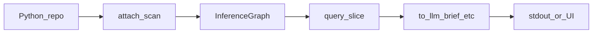

# Nexus tutorial: one map, two surfaces (CLI + UI)

**Repo hub:** [`TUTORIAL.md`](../TUTORIAL.md) (short index + links).

**Screenshots:** Inference Console images use **`docs/ui-screenshots/`** (current UI). For a **longer CLI-focused walkthrough** with every shot plus **`console tutorial/`** extras (CLI IDE proof, metrics), see **[tutorial-nexus-cli-extended.md](tutorial-nexus-cli-extended.md)**.

## Why this exists (core claim)

Most workflows treat the LLM like a **human with an editor**: open a file, read the buffer, infer relationships, open the next file. That forces the **model** to **search by reading text** — expensive and noisy.

**Nexus separates roles:**

1. **CPU (local):** scans the Python tree **once** and holds an **`InferenceGraph`** (symbols, calls, writes, mutation hints, confidence).  
2. **LLM:** does **not** need to “open” files to **discover** structure — it **queries Nexus** with a **`-q` string** (and caps) and gets back a **bounded, topographic slice**: the **shape** of the relevant region — an **IR-like briefing**, not every line of every file.  
3. **Refinement:** to follow another thread or zoom in, the model issues a **new query** (or tighter caps). **Callers, callees, and mutation hints are already in the map** — you are not manually **filtering dependencies** or **rg-ing** the repo; Nexus returns the **next relevant neighborhood** as structured output.

*Nexus’s CLI takes a **`-q` string** (heuristic), not raw natural language. In agent setups, the model chooses the next query; a **tool** or **human** runs `nexus` locally — the important part is **retrieval stays on the CPU** as structure, not file-by-file browsing in the prompt.*

**Tagline:** *Stop reading code. Start querying structure.*  
**One line:** *The model asks the CPU for structure; it doesn’t open files to find it.*

---

## The story this page tells

When you run **`nexus -q "…"`**, Nexus does a fixed sequence of things: scan Python into an **`InferenceGraph`**, pick a **bounded slice** of symbols, then **format** that slice as a brief (plus optional traces). None of that is magic — it is the same code path whether text goes to **stdout** or to **pixels**.

**This tutorial uses the Inference Console as an X-ray of the CLI.** Every screenshot is a *window into the same internals* you would otherwise only see as one scrolling terminal block. The UI does **not** replace the pipeline; it **surfaces** it: table = slice, lower pane = `to_llm_brief`, detail = one symbol’s `SymbolRecord`, Mutation = `trace_mutation`, Focus = one hop over existing edges, Copy = redirect to clipboard.

Read it like a **short story**: first the **ending** (what lands in the terminal), then **seven beats** that replay the same run with the GUI lights on.

**TL;DR**

| Idea | Detail |
|------|--------|
| **Invariant** | One **`InferenceGraph`** per scan: symbols, calls, writes, mutation hints, confidence, layers. |
| **Variable** | *How* you look at it: terminal text, table, graph, clipboard — **not** a second analyzer. |
| **LLM** | **Copy Brief** in the UI = **`nexus -q …`** stdout for the same repo, query, and `--max-symbols` / `--min-confidence`. |
| **Core payoff** | **LLM ↔ Nexus on CPU** for structural slices; **not** LLM ↔ open every file to hunt dependencies. |

---

## Install

**CLI & library** (always):

```bash
pip install -e .
# PyPI: when `nexus-inference` is on your index — `pip install nexus-inference` (see README → Installation)
```

**Inference Console** (optional, needs PyQt6):

```bash
pip install -e ".[ui]"
nexus-console
# or: python -m nexus.ui
```

**CLI commands** (on `PATH` after install): `nexus-opc`, `nexus`, `nexus-grep`, `nexus-policy`, `nexus-cursor-rules`, `nexus-console`. The **distribution** you install with pip is **`nexus-inference`** — not a shell command.

---

## The pipeline (one sentence per stage)



1. **Scan** — `attach` / scan: `.py` → **`InferenceGraph`**.  
2. **Query** — `generic_query_symbol_slice`: heuristic filter + cap → **ordered symbol list**.  
3. **Project** — `to_llm_brief`, `agent_qualified_names`, `trace_mutation`, edges → **text, table, graph, clipboard**.

The CLI jumps straight from (1)→(3) in one process. The Console **pauses** between stages so you can *see* (2) as a table and (3) as panes.

---

## Prologue — the ending you already know (terminal)

Here is the same product **without** the Console: one command, one stream of text. Internally, Nexus has already built the graph, sliced it, and formatted the brief — you just see the **merged** result.


**Inside this output (CLI):** repo line, stats, **`NEXT_OPEN`**, **`SAME_NAME`**, then **`## Mutation / …`** sections — each `###` block is one **`SymbolRecord`** serialized into text. **No LLM** runs here; this is local CPU. **No API tokens** for the analysis; you save **downstream** context because the brief is **capped** (`--max-symbols`).

```powershell
Set-Location F:\Nexus; $env:PYTHONPATH = "F:\Nexus\src"
python -m nexus . -q "mutation flow" --max-symbols 8
python -m nexus src/nexus -q "mutation flow" --max-symbols 6
```

The rest of this page **rewinds** that run in the GUI, frame by frame.

*UI labels in the following screenshots are in German (**Ordner…** = choose folder, **Scan / Refresh** = rebuild map, **Darstellung** = theme). The example repo is **TTRPG Studio**.*

---

## Act I — Beat 1: `attach` (build the graph)

**CLI:** Every `nexus` / `nexus-grep` invocation resolves the path and runs **scan** before anything is printed.  
**UI:** You choose the repo root and press **Scan / Refresh** — that single action is **`attach(repo)`** holding one **`InferenceGraph`** in memory until you refresh.

Until this completes, there is no slice and no brief — same as the CLI waiting before the first byte of stdout.


---

## Act I — Beat 2: slice + `to_llm_brief` (what fills the terminal)

**CLI:** After scan, `-q` runs **`generic_query_symbol_slice`** then **`format_graph_for_llm` / `to_llm_brief`**. Stdout = stats + **`NEXT_OPEN`** + symbol cards.  
**UI:** **Query** + **max sym** runs the **same** functions. The **table** is the slice (same order and membership the brief is built from). The **lower pane** is the **same** brief text you would get from **`nexus -q`** with identical arguments.

So: **the big scrolling block in the terminal** is the **concatenation** of what you see as **table + brief pane** — just laid out for humans in two panels instead of one stream.


---

## Act II — Beat 3: one symbol under the microscope

**CLI:** Inside the brief, each hotspot is a `### qualified_name` block (reads, writes, calls, tags, mutation paths…).  
**UI:** Click a row — the **detail** panel is that **same** symbol’s fields, not a summary. This is the **trust** view: *why* this row exists in the slice.


---

## Act II — Beat 4: `trace_mutation` (same as the library call)

**CLI:** No default subcommand prints this, but the engine exposes **`g.trace_mutation(key)`**.  
**UI:** **Mutation** tab → substring → **trace_mutation** — **direct / indirect / transitive** buckets are the **same** dict the graph method returns.


---

## Act II — Beat 5: one hop over edges (no new graph logic)

**CLI:** You would read **`calls` / `called_by`** or export JSON to see neighbors.  
**UI:** **Focus Graph** draws **only** direct callers and callees for the selected symbol — data already on **`InferenceGraph.edges`** and the symbol lists. Fixed layout; **no** second traversal algorithm.


Same rules, busier slice (many callees):


---

## Act III — Beat 6: choose the projection (stdout modes)

**CLI:** `--names-only`, full `-q` brief, or bounded JSON slice (console uses a **subset** of `to_json_dict`, not full-repo `--json`).  
**UI:** **Copy Minimal / Copy Brief / Copy JSON** call the **same** formatting paths as those modes.


---

## Act III — Beat 7: the brief file = piped stdout

**CLI:** `nexus . -q "…" --max-symbols 12 > brief.txt`  
**UI:** **Copy Brief** → paste — **byte-identical** for same repo, query, caps.


**Closing line of the story:** the text in your editor is **not** a different “LLM edition.” It is **`to_llm_brief`** output — the same string the CLI would have written to fd 1.

---

## CLI cheat sheet (same story, keyboard only)

| Beat | Command |
|------|---------|
| Scan + brief | `nexus . -q "runtime resolver" --max-symbols 12` |
| Names only | `nexus . -q "…" --names-only --max-symbols 12` |
| Annotated names (confidence / layer / `file:line`) | `nexus . -q "…" --names-only --annotate --max-symbols 12` |
| **Canonical perspective** (same contract as Console / library) | `nexus . --perspective heuristic_slice -q "flow" --max-symbols 12` |
| Balanced brief via perspective (incl. special queries) | `nexus . --perspective llm_brief -q "impact SomeClass" --max-symbols 15` |
| Bounded slice JSON | `nexus . --perspective query_slice_json -q "mutation" --max-symbols 20` |
| Trust / one-hop graph (centered) | `nexus . --perspective trust_detail --center-kind symbol_qualified_name --center-ref "pkg.mod.fn"` · `nexus . --perspective focus_graph --center-kind symbol_qualified_name --center-ref "pkg.mod.fn"` |
| Mutation trace JSON | `nexus . --perspective mutation_trace --mutation-key "statekey"` |
| Provenance on stderr | add `--debug-perspective` to any `--perspective` run |
| Slice + grep | `nexus-grep . -q "…" --max-symbols 12` |
| Policy wrapper | `nexus-policy . -q "state"` |
| Full graph (rare, sensitive) | `nexus . --json` — see **SECURITY.md** |

**Rules:** `--perspective` is **mutually exclusive** with `--json`, `--names-only`, `--query-slice-json`, `--trace-mutation`, and `--focus-graph` (use the perspective name instead). **`heuristic_slice`** and **`llm_brief`** may disagree on the same `-q` when special modes apply — by design. Full requirement table: **[`cli-perspective.md`](cli-perspective.md)**.

**PowerShell:** quote `-q` and flags separately, e.g. `python -m nexus . "--perspective" "llm_brief" "-q" "mutation" "--max-symbols" "12"`.

**Library** (inspect the same graph interactively):

```python
from nexus import attach

g = attach("./your_repo")
# g.to_llm_brief(query="mutation", max_symbols=12)
# g.trace_mutation("delta")
```

---

## Recap: two windows, one run

| Stage | **CLI** | **Console** |
|-------|---------|-------------|
| Graph | Built before first output line | **Scan / Refresh** |
| Slice | Implicit in brief / names-only | **Table** |
| Brief | stdout | **Lower pane** + **Copy Brief** |
| One symbol | `###` block in text | **Detail** panel |
| Mutation | `g.trace_mutation` | **Mutation** tab |
| Neighbors | edges / JSON | **Focus Graph** |
| To file / model | `>` redirect, pipe | Clipboard |

---

## Further reading

| Doc | Content |
|-----|---------|
| [Inference Console quick tutorial](inference-console-tutorial.md) | UI-only steps + checklist |
| [Extended CLI tutorial](tutorial-nexus-cli-extended.md) | All new screenshots + deep CLI / PowerShell |
| [Inference Console deep dive](inference-console-deep-dive.md) | `ConsoleSession`, `projections/`, exports, security |
| [CLI perspectives](cli-perspective.md) | `--perspective` contract, flags, examples |
| [Opcode ISA (`nexus-opc`)](tutorial-nexus-opc-isa.md) | Fixed pipelines for agents / Cursor |
| [Proof of concept](proof-of-concept.md) | Narrative PoC |
| [Token efficiency](token-efficiency.md) | Caps, amortization, numbers |
| [Usage metrics (screenshots)](usage-metrics.md) | Real Cursor totals with vs without Nexus |
| [SECURITY.md](../SECURITY.md) | Sensitive exports, ignore/deny |
| [nexus-agent-cursor.md](nexus-agent-cursor.md) | **Agent + Cursor:** loop, terminal, `.mdc` rules |

---

## Checklist

1. Run **`nexus -q`** once — notice stats, `NEXT_OPEN`, symbol blocks.  
2. Open **nexus-console** on the same repo — **Scan**, same **query** and **max sym**.  
3. Confirm **table + brief** match the mental model of the terminal output.  
4. Click a row — see the **same** fields as inside a `###` block.  
5. Try **Mutation** and **Focus** — same APIs as the library / edges.  
6. **Copy Brief** and compare to **`nexus -q …`** stdout — should match.

Welcome to **structural inference** — one pipeline, **terminal or glass**: you choose the window.
