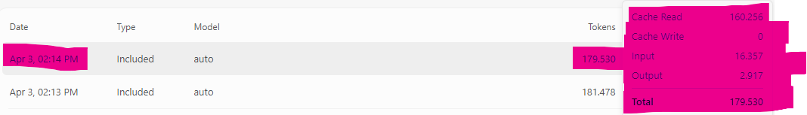
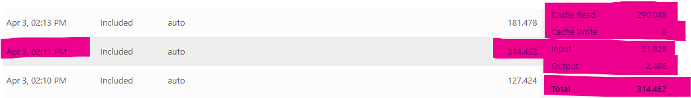
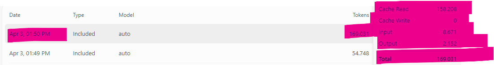
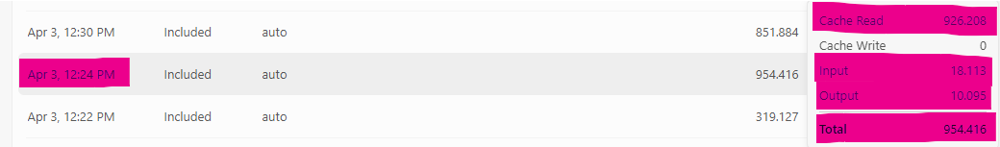
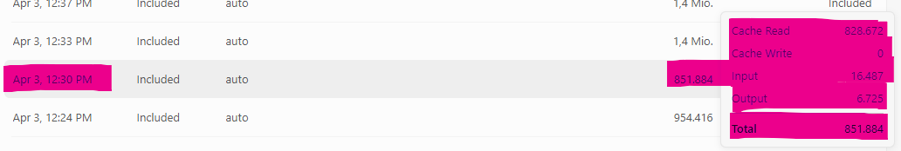
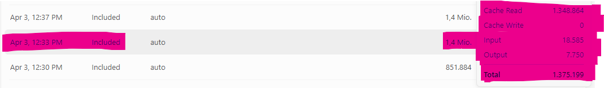
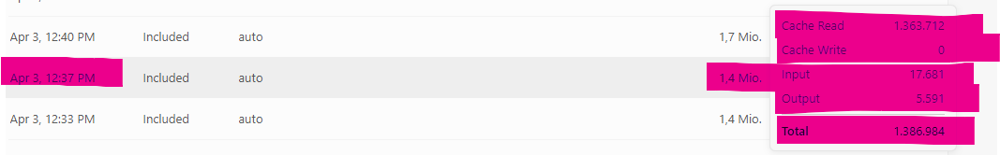
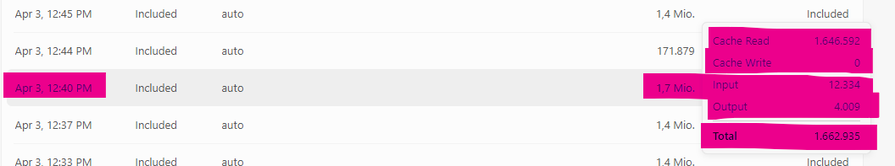
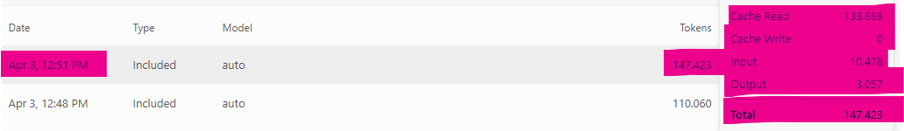
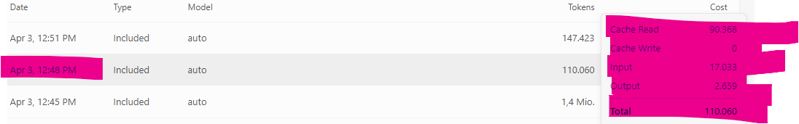

# Agent usage metrics (Cursor): with vs without Nexus

This page documents **screenshots of real agent sessions** (Cursor usage / token dashboard) and a **longitudinal table of usage rows** (**§ Longitudinal usage rows (Apr 1–3, 2026)**). For **programmatic** per-invocation telemetry from the `nexus` CLI (`[NEXUS_METRICS]` on stderr), see **[`token-efficiency.md`](token-efficiency.md)** §2.5 and **[`patchnotes/README.md`](patchnotes/README.md)**. **Canonical copies for GitHub / the website** live under **[`docs/assets/usage-metrics/`](assets/usage-metrics/)** (stable filenames, no spaces). Optional local exports may still sit in **[`usage metrics/`](../usage%20metrics/)** at the repo root under the original names.

| Asset (in `docs/assets/usage-metrics/`) | Meaning |
|------------------------------------------|---------|
| `without-nexus-1.png` … `without-nexus-5.png` | Five separate sessions: **implementation / build-style** agent work **without** Nexus-style tiering (no rule / no `nexus-grep` / `nexus -q` first) — **not** the same task type as the “with Nexus” gallery rows below. |
| `with-nexus-1.png`, `with-nexus-2.png` | Two sessions **with** Nexus in the loop (**analysis-orientation**: structural queries first, bounded slices, then targeted reads). |
| `nexus-self-scan.png` | **This repository** analyzed **with Nexus in the agent loop** (session type labeled like a *Nexus scan* in Cursor). Shows that even a structured workflow still accrues **attributed** model tokens — often with **Cache Read** dominating. |
| `ttrpg-studio-with-nexus.png`, `ttrpg-studio-without-nexus.png` | **Controlled A/B** on a **large** local Python checkout (**TTRPG Studio**): **same analysis-only task** prompt, **with** vs **without** Nexus-style retrieval first (**N=1**). This is the **fair** “Nexus on analysis” benchmark in this doc. Canonical copies here; originals: `rpg studio scan with nexus.png`, `rpg studio scan without nexus.png` in [`usage metrics/`](../usage%20metrics/). |
| `cursor-cross-repo-orientation-110k.png` | **Cross-repo case study** (two local checkouts, **no source files opened** in the agent — Nexus `map`/`locate`/`grep` only): session total **~110k** tokens with **Cache Read** dominant. Narrative + **measured disk / `.py` sizes** (2026-04-03): **[`case-study-cross-repo-orientation.md`](case-study-cross-repo-orientation.md)**. |

Original root filenames (same content as above, where applicable): `works without nexus .png`, …, `works WITH nexus 2.png`; self-scan source: **`analyzed nexus.png`**; TTRPG pair: **`rpg studio scan with nexus.png`**, **`rpg studio scan without nexus.png`** — all under [`usage metrics/`](../usage%20metrics/).

**What you are looking at:** product-reported **total tokens** for a session, usually split into components such as **Input**, **Output**, and **Cache Read** (exact labels depend on the IDE version). **Cache Read** is the dominant line item in these examples — consistent with **large context being re-injected** on many turns when the model repeatedly pulls wide file or grep-shaped material into the prompt.

---

## Measurement map (what is being compared)

**Measuring stick:** **Measured** checkout scale (**Nexus ~13 MB**, **TTRPG Studio ~7.1 GB** total / **~65 MB** `.py` with standard dev-folder excludes, **Aether VPN ~605 MB** total / **~507 KB** `.py**) is **anchored** in **[`case-study-cross-repo-orientation.md` § Measuring stick](case-study-cross-repo-orientation.md#measuring-stick-measured-sizes-2026-04-03)** (full table + method). This page’s “small / large tree” rows **cite** that stick; they do not introduce alternate disk claims.

These captures **do not** all answer the same question. Treat them as **layers** on a timeline, not one mega-chart.

| Layer | Checkout / scale | What the rows represent | Takeaway |
|-------|------------------|-------------------------|----------|
| **Small tree** | **This repo** (Nexus checkout, **~13 MB** on disk — measured 2026-04-03, `F:\Nexus`) | Usage rows from **build-leaning** agent work (**with** vs **without** Nexus in the loop). Example: **~169k** vs **~95k** total; **fresh Input** only **~8.7k** vs **~7.7k** — almost flat. | **Expected:** the **inference graph is tiny**, so Nexus barely reduces **search-shaped** load; the session is **not** a fair stress test for orientation. Good for honesty: *this is where it does not need to shine.* |
| **Large tree (controlled)** | **TTRPG Studio** (local checkout **~7.1 GB** on disk — measured 2026-04-03, `F:\TTRPG Studio`; **~65 MB** `.py` alone with standard dev-folder excludes) | **Same analysis-only task** wording, **Nexus on** vs **off** for retrieval first (**N=1**). See **§ Controlled benchmark** for numbers. | **Fair apples-to-apples** anchor for “Nexus on **analysis**”: **~43%** lower total and **~25%** lower **Input** in the captured pair. |
| **Gallery (mixed task types)** | Various / mixed | **High-token “without Nexus” rows (~0.85M–1.7M)** are **build / implementation** sessions without Nexus tiering. **“With Nexus” gallery rows (~110k–147k)** are **analysis-orientation** with Nexus — **different job** than the build runs, not only a different tool. | Ratios on the order of **~7×–15×** are **real numbers on the dashboard**, but they **confound task type with retrieval mode**. **Do not** treat them as a controlled “Nexus multiplier” for analysis. |

**Fair vs unfair comparison (explicit):**

| Comparison | Fair for “Nexus on analysis”? | What it actually mixes |
|------------|------------------------------|-------------------------|
| **~314k vs ~180k** (TTRPG Studio, **same** analysis prompt, with vs without Nexus) | **Yes** | Same task; only retrieval policy differs. |
| **~1.6M vs ~110k** (gallery: build **without** Nexus vs analysis **with** Nexus) | **No** | **Build / implementation churn** vs **read-heavy analysis** — not a single variable. |

---

## Gallery numbers (build without Nexus vs analysis with Nexus)

These are **rounded** totals read off the dashboards (not a statistical study). **Read the labels:** the **high** “without Nexus” captures are **build / implementation** sessions; the **low** “with Nexus” captures are **analysis-orientation** sessions. The gap is **not** a clean experimental effect of “Nexus off vs on” for one task.

**Without Nexus** (five runs in the screenshots — **build-style** work, no Nexus tiering):

| Approx. total tokens |
|---------------------|
| ~954k |
| ~852k |
| ~1.375M |
| ~1.387M |
| ~1.663M |

**With Nexus** (two runs in the screenshots — **analysis-style** work, Nexus first):

| Approx. total tokens |
|---------------------|
| ~110k |
| ~147k |

**If you naïvely divide** the “with” totals into the “without” totals, you get ratios on the order of **~7×–15×**. That arithmetic is **misleading as a product claim**: it compares **different task types** (build churn vs analysis) as much as it compares retrieval policy. **For a defensible “Nexus on analysis” statement, use the TTRPG Studio A/B** in the next section (**~1.75×** total, **~43%** reduction in the captured pair), not the gallery spread.

**Defensible benchmark for analysis:** only the **TTRPG Studio** pair (same analysis task, same large checkout, **N=1**). The gallery stays **illustrative** (“what sessions can look like”), not a controlled multiplier.

---

## Controlled benchmark: TTRPG Studio (same task, with vs without Nexus)

This pair is **not** the gallery above: **one** deliberate **A/B** on the same **large** checkout, **same analysis-only** agent prompt, **Nexus on** vs **Nexus off** for orientation. Still **N=1** (no variance across repetitions). This is the **only** capture in this document that **isolates** retrieval policy for **analysis** on a large tree.

**Rows read off the screenshots** (Cursor usage table, **Included** / **auto**; tooltip breakdowns):

| Variant | Approx. total | Cache Read | Input | Output |
|---------|----------------|------------|-------|--------|
| **With Nexus** (e.g. Apr 3, ~02:14 PM) | **~180k** | **~160k** | **~16.4k** | **~2.9k** |
| **Without Nexus** (e.g. Apr 3, ~02:11 PM) | **~314k** | **~290k** | **~21.9k** | **~2.5k** |

**Rough read:** total session tokens **~43% lower** in the “with Nexus” capture (**~1.75×** fewer total tokens: **~314k → ~180k**); **fresh Input** **~25% lower**. The largest **absolute** gap is **Cache Read** (**~130k** fewer in the “with” row in this capture) — consistent with **less wide context recycled** across turns while the agent orients. **Output** differs only slightly; the story is **context volume**, not answer length.

**How this sits next to the gallery:** the **five “without”** gallery runs (~**0.85M–1.7M**) are **build** sessions **without** Nexus, not analysis tasks comparable to the **~110k–147k** “with Nexus” analysis rows. **Do not** blend those bands into one “Nexus saves 10×” story. The Studio pair is the **controlled** datapoint for **analysis**.

---

## Self-scan: Nexus repository analyzed with Nexus (Cursor)

This is a **different slice** than the **gallery** above (which mixes **build-without-Nexus** and **analysis-with-Nexus** rows): one **deliberate** workflow where the **Nexus checkout** was inspected **using Nexus** (`nexus-grep` / `nexus -q`, repo map on the CPU) inside Cursor. The usage table still shows **model-attributed** tokens for that chat — **not** the local AST cost (see **[`cursor-metrics-nexus.md`](cursor-metrics-nexus.md)**).

**Observed rows** (same day, two consecutive entries; **Included** / **auto**):

| Time (example) | Approx. total tokens |
|----------------|---------------------|
| Earlier row | **~54.7k** |
| Later row | **~169k** |

**Tooltip-style breakdown** for the **~169k** row (product UI):

| Component | Approx. tokens |
|-----------|-----------------|
| **Cache Read** | **~158k** |
| Input | ~8.7k |
| Output | ~2.2k |
| Cache Write | 0 |

**How to read it:** **Cache Read** is again the bulk — consistent with the model **reusing or reloading a large conversational / tool context window**, even when **orientation** is guided by Nexus instead of raw repo grepping. Totals here are **far below** the **~0.85M–1.7M** **build-without-Nexus** gallery rows (different task type), but **not zero**: agents still pay for reasoning, summaries, and whatever context the host attaches to the thread.

---

## How to read this honestly

**Strong, defensible claim:** On a **large** checkout, for **the same analysis-only prompt**, the captured **TTRPG Studio** pair shows **lower** totals and **lower** fresh **Input** when Nexus shapes retrieval first — with a large **Cache Read** delta consistent with **less wide context** being recycled across turns.

**Gallery claim (qualified):** The **~7×–15×** style gap between **build-without-Nexus** rows and **analysis-with-Nexus** rows is **real on the dashboard** but **not** a fair **single-variable** experiment. Use the gallery as **illustration** of how heavy **implementation** sessions without structural tiering can get — **not** as a peer to the Studio A/B.

**What this is *not*:** A **universal** proof for every repository, model, agent policy, or task mix. Different prompts, tools, and follow-up counts will move the numbers.

**What would make it “paper-grade”:** The same controlled design as the **TTRPG Studio** pair **above**, but **many** repetitions and reported **variance** (the current Studio capture is **N=1**).

**Practical wording for README or posts:**

- *For **analysis** tasks, cite the **TTRPG Studio** controlled pair (**~43%** lower total / **~1.75×** in the capture) as the **primary** quantitative anchor.*
- *The **gallery** shows **build-without-Nexus** vs **analysis-with-Nexus** — useful context, **not** an apples-to-apples multiplier.*
- *The mechanism remains plausible: orientation moves from **text absorption** to **CPU-side structural queries** (`nexus-grep`, `nexus -q`, `--perspective`, `nexus-policy`).*
- *Totals still include reasoning, edits, and intentional reads; Nexus targets **search-shaped** context in the orientation phase.*

---

## Longitudinal usage rows (Apr 1–3, 2026): two token populations

This subsection records a **manual transcription** of many **Cursor usage / billing table rows** (**Included** / **auto**, product-reported **total tokens** per row). The UI locale was **German**: **`Mio.` = millions**, **`.` = thousands separator** (e.g. `102.719` → **~102.7k**, `1,2 Mio.` → **~1.2M**). Rows are **not** paired A/B tasks; they mix **sessions, task types, and workflow** (including adoption of **Nexus-first** Cursor rules and tiered retrieval around **Apr 1, 2026**).

### What the list is a proxy for

Interpreting the pattern (mechanism, not accounting):

| Read | Meaning |
|------|--------|
| **High band (~1.0M–3.9M per row)** | **Exploration-shaped** work: wide context, many turns pulling large tool/file context, **Cache Read**–heavy sessions — “traverse until oriented.” |
| **Low/mid band (~10k–400k per row)** | **Navigation-shaped** work: smaller recycled context per turn — “already know where to look; confirm and edit.” |

This aligns with **moving orientation to CPU-side structure** (`nexus-grep`, `nexus -q`, `--agent-mode`, `nexus-policy`) **before** the model absorbs half a tree. It is **not** a proof that every low row “is Nexus” or every high row “is not”; **task difficulty**, **model**, **chat length**, and **retries** still move the needle.

### Representative numbers from the captured rows

**Upper tail (examples from the same export, Apr 2–3):**

| Approx. total | Example timestamp (local) |
|---------------|---------------------------|
| **~3.9M** | Apr 2, ~09:59 AM |
| **~3.1M** | Apr 2, ~05:52 PM |
| **~2.4M** | Apr 3, ~06:08 PM |
| **~2.3M** | Apr 1, ~04:40 PM |
| **~2.1M** | Several rows (Apr 1–3) |
| **~1.2M–1.9M** | Repeatedly across Apr 1–3 |

**Lower tail (same export, non‑zero):**

| Approx. total | Example timestamp (local) |
|---------------|---------------------------|
| **~12k** | Apr 1, ~07:02 PM (`12.212`) |
| **~13k** | Apr 1, ~11:36 PM (`13.400`) |
| **~18k–30k** | Frequent (e.g. Apr 1 ~08:57 PM, ~09:41 PM; Mar 30 cluster ~16k–43k) |
| **~50k–300k** | Very common once the workflow stabilizes (many rows Apr 1–3) |

**Middle band (~400k–1M)** also appears often — still below the worst megaspikes but far above the “tight loop” rows.

### April 1, 2026 — not a single cutoff, but a mixed transition day

The same log shows **both modes on April 1**:

| Window (local) | Pattern |
|----------------|--------|
| **~04:05 PM – ~05:03 PM** | **Cluster of megaspikes**: e.g. **~628k**, **~1.2M**, **~2.1M**, **~1.1M**, **~1.4M**, **~2.3M**, **~1.6M**, **~2.1M**, plus **~0.59M** — classic **heavy exploration / long context** band. |
| **Same calendar day** | **Many concurrent smaller rows** (**~12k–300k** and mid hundreds of thousands), not rare exceptions. |

**Takeaway:** April 1 is best read as **coexistence and migration** (new **agent policy / Nexus-first habit** gaining share), **not** as “before midnight = only millions, after = only 100k.” For external claims, prefer **correlates with adoption of tiered retrieval** over **proven by calendar date**.

### How to cite this block

- **Strong:** “Usage tables show **two populations** — megaspike sessions vs. much smaller totals — consistent with **less search-shaped context** when orientation is structural.”  
- **Careful:** “**Not** a controlled experiment; **N=1 export**, mixed tasks; **Apr 1** is **mixed**, not a sharp boundary.”  
- **Quantitative anchor for product posts:** still lead with the **TTRPG Studio** A/B in **§ Controlled benchmark**; use this longitudinal section as **supporting narrative**, not a second multiplier claim.

---

## Screenshot gallery

### Without Nexus (five runs — **build** sessions, no Nexus tiering)

### With Nexus (two runs — **analysis** sessions, Nexus first)

### Nexus on Nexus (self-scan, one session capture)

See **§ Self-scan** (heading above) for numbers and the full-size image `nexus-self-scan.png`.

### TTRPG Studio (controlled A/B, one pair)

See **§ Controlled benchmark: TTRPG Studio** for numbers. Images: `ttrpg-studio-with-nexus.png`, `ttrpg-studio-without-nexus.png` (also inlined in that section).

---

## Relation to the CLI

The **same** structural views the Console exposes are available on the command line via **`nexus --perspective …`** (stable names shared with the library). Typical agent-facing flow:

1. **`nexus-grep`** or **`nexus-policy`** — thin slice, few symbols.  
2. **`read_file`** (or editor) only at **`NEXT_OPEN`** / named paths.  
3. Deeper questions: **`nexus -q`** or **`--perspective llm_brief`** with a small **`--max-symbols`**.  
4. Centered views: **`trust_detail`**, **`focus_graph`**; mutation: **`mutation_trace`** — see **[`cli-perspective.md`](cli-perspective.md)**.

That loop is what the “WITH nexus” sessions are meant to reflect: **query the map first**, then read narrowly.

---

## See also

- **[`token-efficiency.md`](token-efficiency.md)** — caps, amortization, and why **totals alone** do not tell the whole story (§1.1).  
- **[`nexus-scaling-law.md`](nexus-scaling-law.md)** — why structural retrieval’s **relative** advantage tends to **grow with repository size** (informal argument, caveats).  
- **[`cursor-metrics-nexus.md`](cursor-metrics-nexus.md)** — why some dashboard lines may look surprising when work moves off the model.  
- **[`nexus-agent-cursor.md`](nexus-agent-cursor.md)** — agent loop, rules, recommended tiering.
